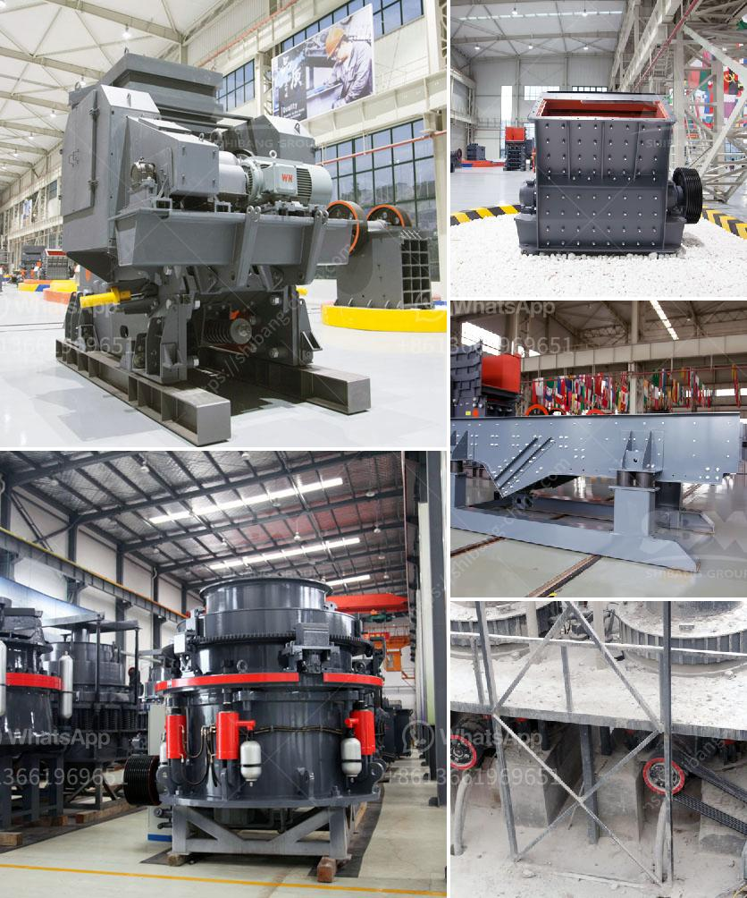

<h3>stone crusher machines made in nigeria</h3>
Nigeria is a vast country with considerable wealth in natural resources and understanding Nigeria’s geology is critical for efficient exploration and exploitation of these resources. Stone crushing is an important part in mining industry and require high quality stone crushing machines.

Nigeria located in West Africa is the most populous country in Africa and the seventh most populous country in the world. With an estimated population of over 200 million, it is a major market for stone crushing machines. When it comes to investing in a stone crushing machine, many small and medium-sized businesses are unable to afford the high cost of purchasing these machines. To this end, the Nigerian government has put in place measures to ensure that these machines are easily accessible by various entrepreneurs in the country.

The stone crushing machines found in the market today are built with technological advancements that help improve their efficiency. With sizes ranging from 15t/hr to 2000t/hr, these machines are capable of crushing all types of materials efficiently. The stone crushing machines are used in various fields such as building materials, mining, metallurgy, highways, chemistry, railways, as well as continuous requirement from construction activities, such as highways, roads, canals, buildings, and bridges, etc. Growing construction activities, steady growth of economies as well as continuous development of roads and highways globally is expected to fuel the demand for stone crushing equipment over the forecast time period.

The preference towards stone crushing equipment is primarily due to the fact that it is efficient in breaking down large stones into the small required sizes that can be directly used in building activities without having to first undergo extensive crushing and screening. While there are a variety of stone crushers available in the market, each crusher has its own unique features and capabilities.

The most commonly used stone crushing machines are: jaw crusher, impact crusher, hammer crusher, cone crusher, roller crusher and so on. Different crushers, feeders, conveyors and vibrating screens compose the complete crushing plant which is widely used in mineral processing, construction materials, silicate and chemical industries.

In the production of mineral processing plants, the crushers crush hard or medium hard metal ores of gold, silver, copper, lead, zinc, nickel, manganese, iron, molybdenum, chromium, tin and others, as well as stone, rock, granite, limestone, barite, quartz, graphite, feldspar, fluorspar, etc. Different types of crushers are used for crushing different types of materials, ranging from soft coal to very hard iron ore.

Stone crushing plants are generally equipped with a primary crushing unit and a secondary crusher with a screen plant. The primary crushing unit is generally a jaw crusher or cone crusher depending on the capacity requirement. Jaw crusher is capable of primary crushing and cone crusher is used for secondary crushing. The material of crusher plays an important role in its working efficiency and service life. However, the regular operation and maintenance are important, too.

During the using process, if the worker operates and maintains the crusher according to correct standards, it will have great significance in normal production, output, quality, service life, working efficiency and the prevention of accidents, etc. Please feel free to contact us for more information on stone crushing machines.
<h3>Contact us</h3><ul><li><strong>Whatsapp:&nbsp;<a href="https://wa.me/8613661969651">+8613661969651</a></strong></li><li><a href="https://swt.shibang-china.com/?git&amp;zhl&amp;stone crusher machines made in nigeria"><strong>Online Service(chat now)</strong></a></li></ul><h3>Related</h3><ul><li><a href='calcite grinding mill.md'>calcite grinding mill</a></li><li><a href='stone mining and quarrying business plan.md'>stone mining and quarrying business plan</a></li><li><a href='chrome ore crushers and screeners for hire in south africa.md'>chrome ore crushers and screeners for hire in south africa</a></li><li><a href='stone crusher plant tph layout.md'>stone crusher plant tph layout</a></li><li><a href='raymond mill for sale second hand.md'>raymond mill for sale second hand</a></li></ul>