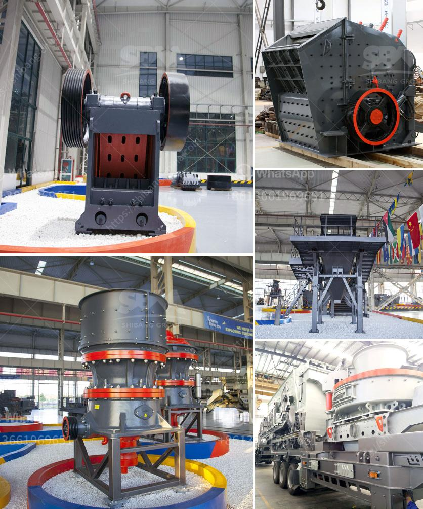

<h3>stone crusher malaysia</h3>
The construction industry is increasingly being driven by the need to meet the demand for infrastructure development globally. With rapid urbanization, the need for housing and infrastructure development is on the rise. As a result, the stone crusher industry in Malaysia has been growing rapidly due to this ever-increasing demand.

Stone crusher machines are widely used in building construction, mining, highway, railway, and industrial manufacturing. They are the ideal equipment for crushing stones, rocks, ores, and other solid materials. With the increasingly mature stone crusher market in Malaysia, we are confident in being able to provide the best stone crusher machines in the industry.

Stone crushing machines are widely used in mining industry. These machines are used to break large chunks of stones or mined material into smaller pieces for further processing. These machines can be used for primary crushing or secondary crushing. Depending on the application, they can be used independently or in combination with other crushing equipment.

There are several types of stone crushers available in the market: jaw, cone, impact, and roller crusher. Each type has its own unique features and advantages. For example, jaw crushers are considered the most common and widely used crushers due to their smaller size and simple structure. Cone crushers are best suited for secondary crushing applications and are capable of producing finer particles. Impact crushers, on the other hand, are ideal for producing high-quality cubical aggregates.

In Malaysia, many stone crusher machines are available for sale. Customers can choose from a variety of models and capacities according to their needs. As the leading stone crusher machine manufacturer in Malaysia, we have the expertise and experience to offer our customers the best machines and service. We ensure that our stone crusher machines are of high quality and made with the latest technology to provide reliable performance and long service life.

As a responsible stone crusher machine manufacturer, we focus on providing comprehensive solutions for our customers. We not only offer high-quality machines, but also provide efficient after-sales service. Our team of experienced engineers and technicians can quickly address any issues or concerns our customers may have. This ensures that our customers can continue to operate their stone crusher machines with minimal downtime.

Furthermore, we are committed to environmental sustainability. Our stone crusher machines are designed to minimize emissions and reduce energy consumption. We use advanced technologies and materials to make our machines more eco-friendly and efficient.

In conclusion, the stone crusher industry in Malaysia is growing steadily due to the ever-increasing demand for infrastructure development. We, as a stone crusher machine manufacturer, are committed to providing our customers with the best machines and service. With our wide range of products and expertise, we are confident in meeting the needs of our customers and contributing to the development of Malaysia's construction industry.
<h3>Contact us</h3><ul><li><strong>Whatsapp:&nbsp;<a href="https://wa.me/8613661969651">+8613661969651</a></strong></li><li><a href="https://swt.shibang-china.com/?git&amp;zhl&amp;stone crusher malaysia"><strong>Online Service(chat now)</strong></a></li></ul><h3>Related</h3><ul><li><a href='stone crusher machine for sale uae.md'>stone crusher machine for sale uae</a></li><li><a href='sand washing plant saudi arabia.md'>sand washing plant saudi arabia</a></li><li><a href='grinding marble stone price.md'>grinding marble stone price</a></li><li><a href='formato de la planta de trituracion de mantenimiento.md'>formato de la planta de trituracion de mantenimiento</a></li><li><a href='crusher and screen for sale philippines.md'>crusher and screen for sale philippines</a></li></ul>