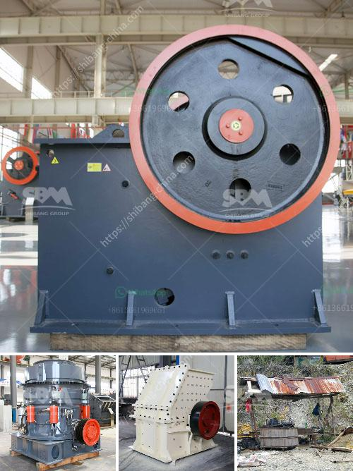

<h3>stone crusher manufacturer dhaka</h3>
Stone Crusher Manufacturer Dhaka is one of the leading manufacturers of crushing machines in Bangladesh. Since its establishment in 2002, it has been striving to provide customers with high-quality equipment as well as a satisfactory service. With its dedication, hard work, and innovation, Stone Crusher Manufacturer Dhaka has built a reputation of trust and reliability among its customers.

The stone crushing industry plays a significant role in the economy of Bangladesh. The rapid growth of the country's construction sector has led to an increasing demand for stone crushers. This has fueled a thriving market for both national and international manufacturers, including Stone Crusher Manufacturer Dhaka.

What sets Stone Crusher Manufacturer Dhaka apart from its competitors is its strong focus on research and development. The company invests a significant amount of its revenue in developing new technologies and improving existing products. This commitment to innovation has enabled the company to manufacture crushers that are efficient, durable, and provide excellent crushing performance.

One of the key products offered by Stone Crusher Manufacturer Dhaka is its double toggle jaw crushers. These crushers are designed to crush different types of materials, whether it is hard, soft, or even brittle. The company's crushers are equipped with advanced technology that ensures a precise and uniform crushing process. This results in a high-quality end product that meets the customer's specifications.

In addition to jaw crushers, Stone Crusher Manufacturer Dhaka also produces cone crushers, impact crushers, and hammer crushers. These crushers are used to crush larger rocks and stones into smaller pieces, making them suitable for construction purposes. The company's crushers are designed to deliver maximum performance with minimal maintenance, ensuring high productivity and cost-effectiveness.

Apart from manufacturing crushers, Stone Crusher Manufacturer Dhaka also provides a comprehensive range of after-sales services. The company's service centers are located in different parts of the country, enabling it to offer prompt support and maintenance to its customers. This ensures that the crushers continue to operate smoothly, maximizing their lifespan and reducing downtime.

Another factor that has contributed to the success of Stone Crusher Manufacturer Dhaka is its strong emphasis on customer satisfaction. The company believes in building long-term relationships with its customers, based on mutual trust and understanding. It provides personalized solutions and actively seeks feedback to improve its products and services. This customer-centric approach has earned the company a loyal customer base, and today it is recognized as a trusted and reliable name in the stone crushing industry.

In conclusion, Stone Crusher Manufacturer Dhaka has established itself as a leading player in the stone crushing industry in Bangladesh. Its commitment to delivering high-quality equipment, coupled with its continuous investment in research and development, has made it a preferred choice for customers. With its strong after-sales service and customer-centric approach, the company has earned a reputation for reliability and trust. As the demand for stone crushers continues to grow, Stone Crusher Manufacturer Dhaka is well-positioned to cater to the needs of its customers and maintain its market leadership.
<h3>Contact us</h3><ul><li><strong>Whatsapp:&nbsp;<a href="https://wa.me/8613661969651">+8613661969651</a></strong></li><li><a href="https://swt.shibang-china.com/?git&amp;zhl&amp;stone crusher manufacturer dhaka"><strong>Online Service(chat now)</strong></a></li></ul><h3>Related</h3><ul><li><a href='price jaw crusher 100tph india.md'>price jaw crusher 100tph india</a></li><li><a href='mobile crusher malaysia for sell.md'>mobile crusher malaysia for sell</a></li><li><a href='netherland ore processing and crusher company.md'>netherland ore processing and crusher company</a></li><li><a href='price of a tph sand fluidized bed dryer.md'>price of a tph sand fluidized bed dryer</a></li><li><a href='cost of a stone crusher machine.md'>cost of a stone crusher machine</a></li></ul>