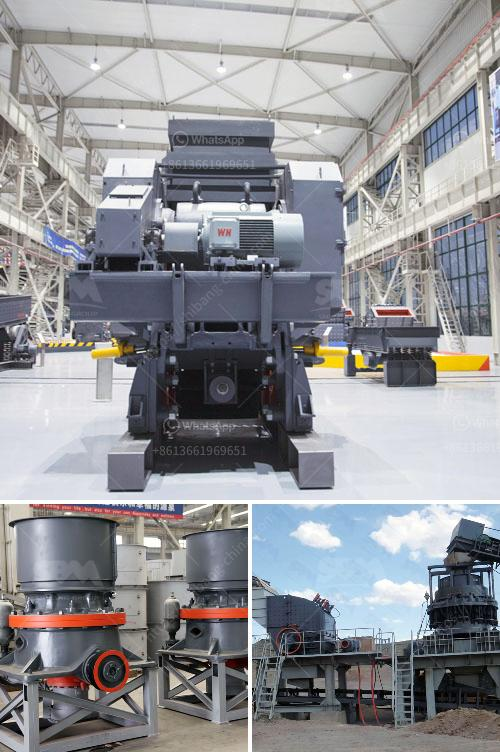

<h3>stone crusher manufacturers</h3>
A stone crusher is a machine used to convert large stones into smaller sizes that can be used in construction or other purposes. There are several types of stone crushing machines, which are differentiated based on the stone processing stages, namely primary crusher, secondary crusher, and tertiary crusher.

Stone crusher manufacturers are in a competitive market, with high pressure on their profit margins as they face various challenges, such as cost management and product quality. We, at Propel Industries, understand the importance of meeting these challenges and are committed to providing solutions to ensure that our customers succeed.

One of the key factors that sets Propel Industries apart from other stone crusher manufacturers is our in-house manufacturing capabilities. We have a state-of-the-art manufacturing facility with advanced machinery and equipment, which allows us to control the entire production process, from design to final delivery. This enables us to ensure the highest quality standards are maintained throughout the manufacturing process.

In addition to our manufacturing capabilities, we also have a strong focus on research and development. Our dedicated R&D team is constantly working on improving our stone crushing machines, making them more efficient, reliable, and environmentally friendly. We understand the importance of staying ahead of the curve and constantly innovating to meet the changing needs of our customers.

Our commitment to quality and customer satisfaction has earned us a strong reputation in the industry. We have a wide customer base, both in India and abroad, and we take pride in providing the best stone crushing machines to our customers. Our machines are known for their robust construction, high performance, and low maintenance requirements.

In conclusion, stone crusher manufacturers play a vital role in the development of infrastructure and construction industry. We are committed to delivering high-quality stone crushing machines that exceed our customers' expectations. With our manufacturing capabilities, research and development focus, and commitment to customer satisfaction, we are confident that Propel Industries will continue to be a leading stone crusher manufacturer in the years to come.
<h3>Contact us</h3><ul><li><strong>Whatsapp:&nbsp;<a href="https://wa.me/8613661969651">+8613661969651</a></strong></li><li><a href="https://swt.shibang-china.com/?git&amp;zhl&amp;stone crusher manufacturers"><strong>Online Service(chat now)</strong></a></li></ul><h3>Related</h3><ul><li><a href='used crusher machine germany.md'>used crusher machine germany</a></li><li><a href='cost of a small scale cement plant in india.md'>cost of a small scale cement plant in india</a></li><li><a href='limestone crusher mining equipment.md'>limestone crusher mining equipment</a></li><li><a href='used h 6000 cone crushers for sale.md'>used h 6000 cone crushers for sale</a></li><li><a href='feldspar stone for sale india.md'>feldspar stone for sale india</a></li></ul>