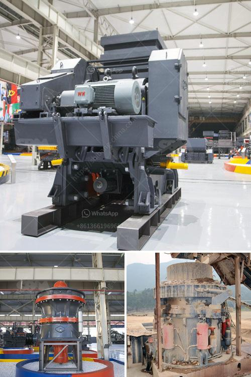

<h3>stone crusher mesh size</h3>
Crushing is generally considered to be the first stage of size reduction. In most industries, crushing processes are followed by milling or grinding to produce smaller particles to achieve the desired results. The stone crusher is a machine used to convert large rocks into smaller rocks, gravel, or rock dust. Crushing and grinding stones are pivotal in the process of construction and mining. The ultimate goal is to achieve the desired size, which can be conveniently done through screens or mesh. In this article, we will discuss stone crusher mesh sizes and the factors to consider while selecting them.

Mesh size is a measurement of the number of holes or openings per linear inch in screens used for sieving or filtering. Stone crusher screens are similar in construction and function to riddles. The mesh size refers to the number of holes or openings in the mesh per inch. Different mesh sizes are used for different applications in the construction industry. For instance, fine mesh sizes are used for sand sieving, while coarser mesh sizes are used for gravel or stone separating.

Choosing the right mesh size is essential as it directly affects the efficiency and performance of the stone crusher. Here are some factors to consider while selecting the mesh size:

1. Application: The first and foremost factor to consider is the application for which the stone crusher will be used. Different applications require different mesh sizes. For example, if the stone crusher is used for gravel production, a coarse mesh size is appropriate to separate larger stones from the smaller ones.

2. Size of the feed material: The size of the feed material that needs to be processed by the stone crusher is another crucial factor. Smaller mesh sizes are suitable for crushing small-sized stones, while larger mesh sizes are used for processing larger rocks.

3. Desired output size: The desired output size plays a significant role in determining the mesh size. If the output size needs to be finer, a smaller mesh size should be selected. Conversely, if a coarser output size is desired, a larger mesh size is recommended.

4. Efficiency: Mesh size greatly affects the efficiency of the stone crusher. Choosing the appropriate mesh size ensures that the machine operates at its maximum efficiency, saving time and reducing energy consumption.

5. Maintenance and longevity: The selected mesh size should be durable and easy to clean. Regular maintenance and cleaning are essential to keep the stone crusher functioning optimally. Therefore, it is crucial to choose a mesh size that is easy to maintain and offers longevity.

In conclusion, selecting the right stone crusher mesh size is vital for efficient and effective crushing operations in construction and mining industries. The mesh size should be chosen based on the application, size of the feed material, desired output size, efficiency, and maintenance requirements. Carefully considering these factors will help in choosing the appropriate mesh size, leading to improved efficiency and performance of the stone crusher.
<h3>Contact us</h3><ul><li><strong>Whatsapp:&nbsp;<a href="https://wa.me/8613661969651">+8613661969651</a></strong></li><li><a href="https://swt.shibang-china.com/?git&amp;zhl&amp;stone crusher mesh size"><strong>Online Service(chat now)</strong></a></li></ul><h3>Related</h3><ul><li><a href='how many jaw crusher manufacturer company in india.md'>how many jaw crusher manufacturer company in india</a></li><li><a href='limestone crusher plant tph.md'>limestone crusher plant tph</a></li><li><a href='coal screening chrushing machines.md'>coal screening chrushing machines</a></li><li><a href='used concrete crushing plant for sale in uae.md'>used concrete crushing plant for sale in uae</a></li><li><a href='stone crusher machine spintex accra.md'>stone crusher machine spintex accra</a></li></ul>