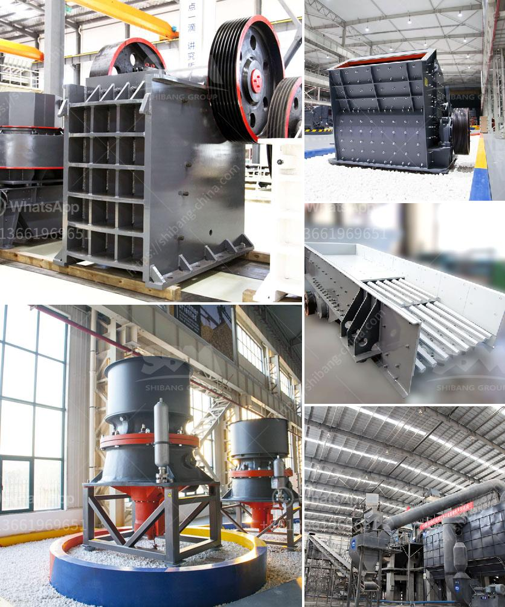

<h3>stone crusher mini type</h3>
Stone crusher mini type refers to the small model of stone crusher machines. This type of stone crushing machine is commonly used in various mining, building materials, refractory, cement, highways and other industries. It can crush large stones into small pieces. Mini stone crusher machines are popular for their low price and excellent performance.

In practice, mini stone crusher machines can break stones with a diameter of 150mm or less into small particles with a diameter of 5-50mm. This type of small stone crusher is often used in the crushing and processing of various stones and minerals with a compressive strength of 320 MPa or less. The mini stone crusher machine is suitable for such materials as granite, pebbles, limestone, quartz stone, iron ore, copper ore and gold ore.

The main advantages of mini stone crusher machines are small size and small footprint. They can be easily moved from one site to another. The mini stone crusher machine has a flexible configuration, and can be designed with an on-board chassis or a trailer frame for easy towing and installation. On the other hand, mini stone crusher machines are also equipped with power options, including diesel generators, which can meet the needs of power supply, ensuring continuous operation while avoiding power outages.

Another advantage of the mini stone crusher machine is its high efficiency. It can effectively crush materials into smaller particles, which greatly improves the crushing efficiency and capacity of the entire production line. The mini stone crusher machine has simple structure, small footprint, and low operating cost. It can save the investment cost and operation cost of the production line. The belt conveyor is optional, and can be quickly and easily loaded and unloaded according to different production requirements.

In addition, the mini stone crusher machine has a wide range of applications. It can crush various stones and minerals. It is often used in various mining, building materials, refractory, cement, highways and other industries. It can be used for primary crushing and secondary crushing. It can also be used to crush materials with different hardness levels, such as granite, iron ore, limestone, quartz stone, etc.

To sum up, the mini stone crusher machine is a practical and efficient crushing equipment. It has the characteristics of small size, low price, high efficiency, and wide application range. It is an ideal choice for small and medium-sized stone crushing production lines. If you are in need of a mini stone crusher machine, please contact us for further information.
<h3>Contact us</h3><ul><li><strong>Whatsapp:&nbsp;<a href="https://wa.me/8613661969651">+8613661969651</a></strong></li><li><a href="https://swt.shibang-china.com/?git&amp;zhl&amp;stone crusher mini type"><strong>Online Service(chat now)</strong></a></li></ul><h3>Related</h3><ul><li><a href='coal mining processes and machinary required.md'>coal mining processes and machinary required</a></li><li><a href='talc powder plant.md'>talc powder plant</a></li><li><a href='price for stone crusher plant.md'>price for stone crusher plant</a></li><li><a href='bentonite processing machinery.md'>bentonite processing machinery</a></li><li><a href='picture of a rock crusher machine.md'>picture of a rock crusher machine</a></li></ul>