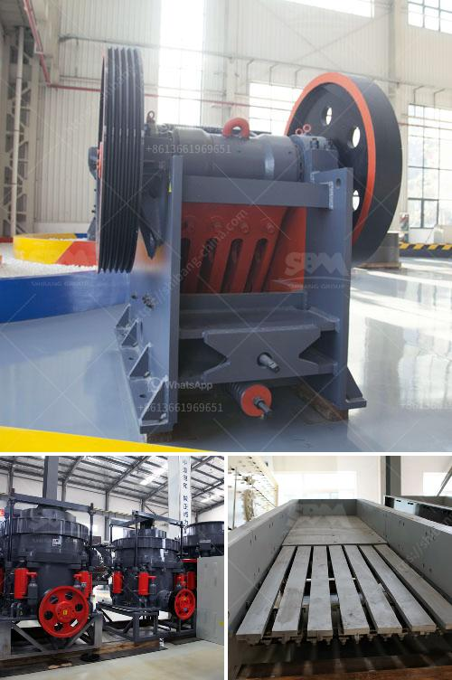

<h3>stone crusher mobile crusher layout</h3>
Stone crusher mobile crusher layout is designed around the core concept of easy installation and transportation. It offers significant cost savings compared to traditional stationary crushing plants. With the mobile crusher, you can reduce the need for excessive hauling of raw materials. This ultimately cuts down on fuel consumption and ensures a more sustainable operation.

The layout of a stone crusher mobile crusher includes primary crushing equipment, secondary crushing equipment, and belt conveyor. Each stage of crushing produces smaller particle sizes to meet the requirements of different construction materials. The primary crusher, usually a jaw crusher or gyratory crusher, breaks large stones into smaller pieces. These smaller pieces are then conveyed to the secondary crusher for further size reduction. Finally, the crushed stones are transported to the required location via a belt conveyor.

One of the great advantages of a stone crusher mobile crusher layout is its flexibility. The mobile crusher can be easily moved to different locations as per the need. This allows for efficient utilization of resources and minimizes the downtime associated with relocating a stationary crusher. Moreover, the mobile crusher can be customized to fit different applications. For example, it can be equipped with a vibrating screen to separate different sizes of stones or a magnetic separator to remove any iron contaminants.

Overall, a stone crusher mobile crusher layout offers numerous benefits for construction companies. It eliminates the need for excessive transportation, saves on fuel costs, and provides flexibility in terms of location and application. Additionally, mobile crushers are more environmentally friendly by reducing carbon emissions associated with traditional crushing operations. This efficient and sustainable design makes stone crusher mobile crusher layout a preferred choice for many construction projects.
<h3>Contact us</h3><ul><li><strong>Whatsapp:&nbsp;<a href="https://wa.me/8613661969651">+8613661969651</a></strong></li><li><a href="https://swt.shibang-china.com/?git&amp;zhl&amp;stone crusher mobile crusher layout"><strong>Online Service(chat now)</strong></a></li></ul><h3>Related</h3><ul><li><a href='conventional hammer mills.md'>conventional hammer mills</a></li><li><a href='stone crusher mesh size.md'>stone crusher mesh size</a></li><li><a href='pyrite coal mill pakistan.md'>pyrite coal mill pakistan</a></li><li><a href='crusher machine bottlecrusher machine bottles.md'>crusher machine bottlecrusher machine bottles</a></li><li><a href='mini cement plant capacity of 5 ton per day.md'>mini cement plant capacity of 5 ton per day</a></li></ul>