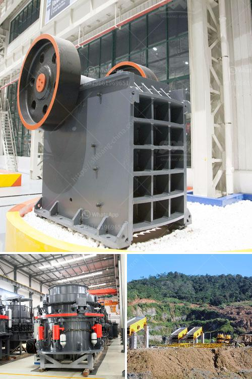

<h3>stone crusher pe price</h3>
When it comes to choosing the right stone crusher, it’s essential to consider various factors, including the price. The cost of a stone crusher PE model can vary significantly depending on the size, capacity, and functionality. However, by understanding your specific construction requirements and budget constraints, you can make an informed decision and ensure the crusher meets your needs without breaking the bank.

One primary factor to consider is the size of the stones you need to crush. If you have large stones, opting for a model with a higher capacity and an efficient motor is crucial. This will ensure that the machine can handle the workload and increase productivity on your construction site. On the other hand, for smaller stones, a less robust model may be sufficient, offering a lower price point.

Capacity is another vital consideration. Ensuring your stone crusher can handle the required volume of crushed stone is essential for efficient construction operations. If your projects involve large-scale stone crushing, then investing in a higher-capacity machine could prove cost-effective in the long run, as it reduces the need for frequent repairs or upgrades.

The functionality of the stone crusher is equally important. Different models come with different features, such as adjustable settings, multiple feeding sizes, or even the ability to produce various stone sizes. Understand your specific construction requirements and choose a model that offers the necessary functionalities to accomplish your objectives effectively.

Of course, price is always a significant factor in any purchase decision. And finding the balance between functionality, capacity, and cost is essential. While a higher-priced model may promise advanced features, it may not always be necessary for your specific construction needs. Conversely, choosing the lowest-priced option might compromise on durability or efficiency. It’s essential to strike a balance between your budget and the quality of the stone crusher.

In conclusion, when considering a stone crusher PE model, it’s crucial to assess your specific construction requirements, including the size and capacity of the stones you need to crush. Additionally, take into account the desired functionality and strike a balance between the price and the machine's quality. By making an informed decision, you can ensure that your stone crusher meets your needs, maximizes productivity while remaining within your budget.
<h3>Contact us</h3><ul><li><strong>Whatsapp:&nbsp;<a href="https://wa.me/8613661969651">+8613661969651</a></strong></li><li><a href="https://swt.shibang-china.com/?git&amp;zhl&amp;stone crusher pe price"><strong>Online Service(chat now)</strong></a></li></ul><h3>Related</h3><ul><li><a href='copper oxide beneficiation plant china.md'>copper oxide beneficiation plant china</a></li><li><a href='stone crushers industries in west bengal.md'>stone crushers industries in west bengal</a></li><li><a href='machinery required to extract the platinum.md'>machinery required to extract the platinum</a></li><li><a href='screw feeder capacity 5 ton hour.md'>screw feeder capacity 5 ton hour</a></li><li><a href='type of conveyors belt pdf.md'>type of conveyors belt pdf</a></li></ul>