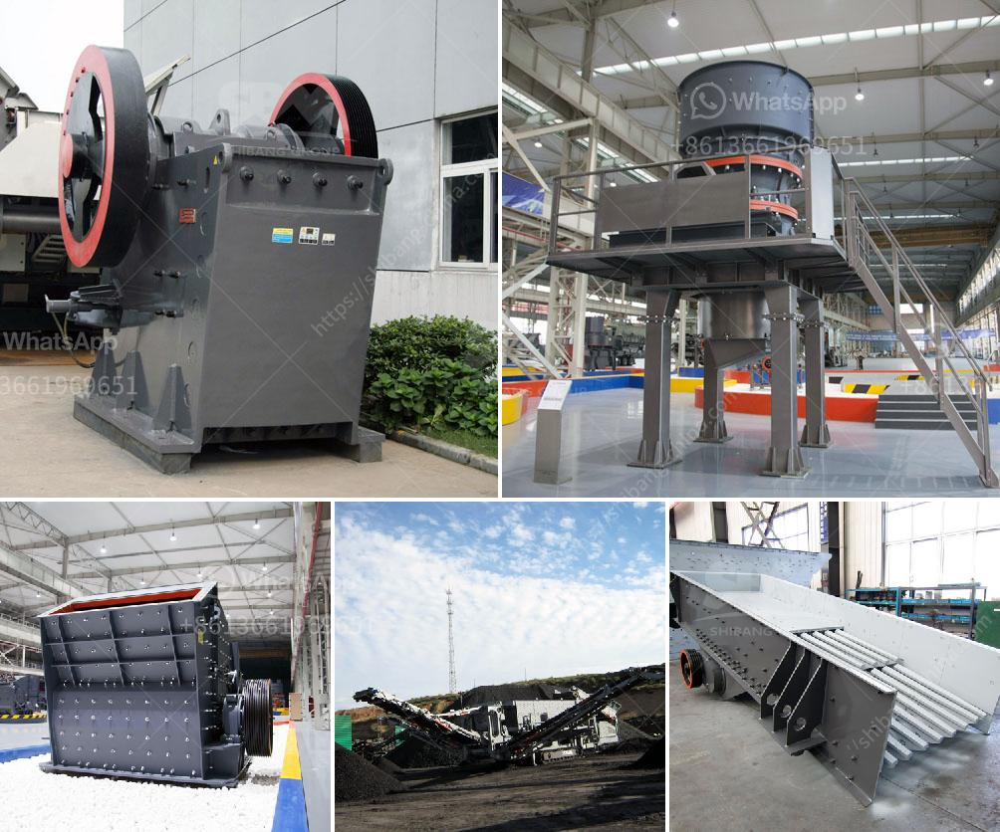

<h3>stone crusher plant 100tph layout</h3>
Stone crusher plant is a machine designed to reduce the large stone, granites, marble, lime rocks into the smaller size and output gravel, dust, different size of the material.

Stone crusher plants used worldwide. It is available with different-2 capacity, design, and utility. Uses of Crusher plant

Stone crushing industry engaged in producing a crushed stone that used as a raw material for infrastructure projects like, road, highway, bridges, building canals, etc. All projects are considered as the core infrastructure work that gives the economy boom. Stone crusher units are not alone. Along with these plants, stone mining also associated.

In fact, stone mining is the primary activity, and the crushing plant is the secondary activity that can be considered. Raw materials used for crushing unit

Coal, Stone, Granite, limestone, Basalt, River stone, andesite calcite, abrasive rocks, glass, and ferrous material used for the crushing purpose. Stone Crusher plant Capacity

The stone crusher plant will available from 50 TPH to 600 TPH (ton per hour). The plant can produce the 8 variants of material. Just to get the different variant material you also need to put the screening plant that just separates the different materials according to client or market demand.

Raw Material processed through the vibrating feeder to crusher gradually and crusher crushed the material into respective pieces. From Crusher material conveyed to belt conveyor for secondary crushing before went on vibrating screen plant. Vibrating screen plant separates the quality and qualified material to final products. And unqualified material carried back to stone crusher and reprocesses it. Then again material went through the above process.

The customer gets the required material according to the standard quality and different sizes. And the various size of the crushed stone, it can be used for the construction of roads, bridge, buildings, and canals. With the increasing economy growth, the infrastructure construction sector is booming. There will be more requirement for stone crusher plant.

The design production is commonly 50-800T/H to meet different processing needs of customers and it can be equipped with cone crusher, dust removal equipment, etc. The crushing plant we have designed has a large capacity, which enables the crushing plant to process about 5000 tons of stone per hour.

In addition to the stone crushing, we can also add other equipment such as cone crushers, dust catchers and so on to the production line to meet different requirements of our customers. Therefore, if you are looking for stone crushing plant, please contact us with your specific needs. We will provide you with suitable customized solutions.
<h3>Contact us</h3><ul><li><strong>Whatsapp:&nbsp;<a href="https://wa.me/8613661969651">+8613661969651</a></strong></li><li><a href="https://swt.shibang-china.com/?git&amp;zhl&amp;stone crusher plant 100tph layout"><strong>Online Service(chat now)</strong></a></li></ul><h3>Related</h3><ul><li><a href='diamond screening plant south africa.md'>diamond screening plant south africa</a></li><li><a href='sand washinng plant makers in srilanka.md'>sand washinng plant makers in srilanka</a></li><li><a href='cost of a small scale cement plant in india.md'>cost of a small scale cement plant in india</a></li><li><a href='grinding mills in usa.md'>grinding mills in usa</a></li><li><a href='list of used machines coal mining.md'>list of used machines coal mining</a></li></ul>