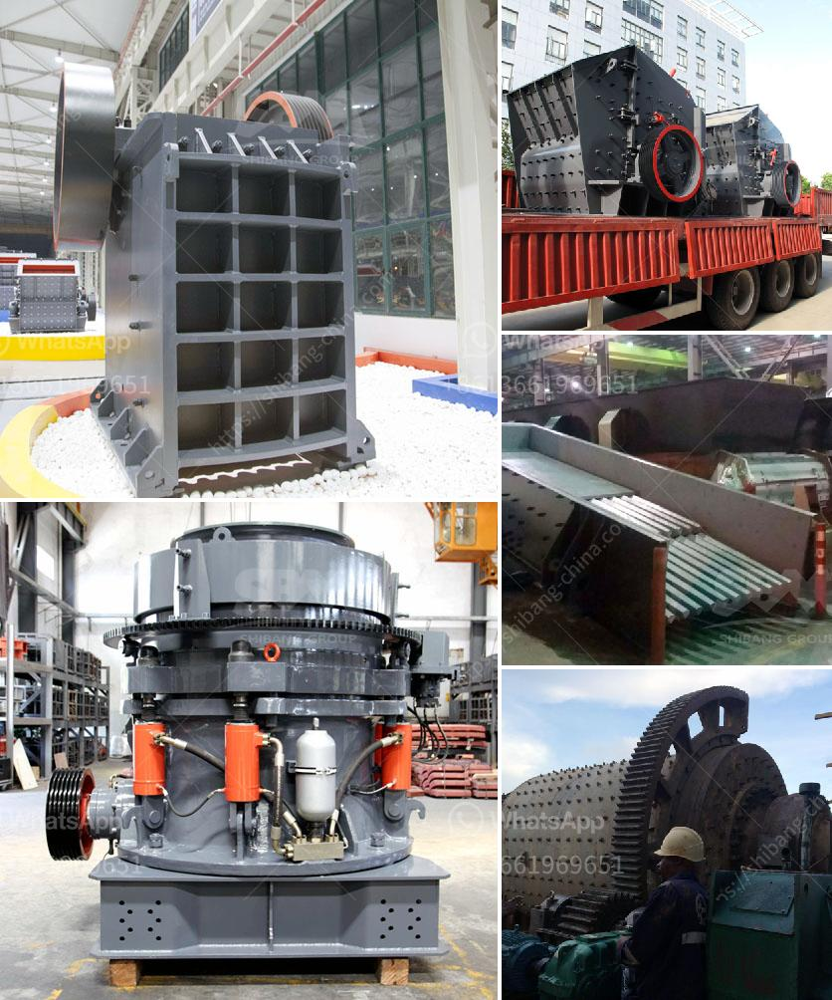

<h3>stone crusher plant 80 ton</h3>
Stone crusher plant is a machine designed to reduce the large stone, granites, marble, lime rocks into the smaller size and output gravel, dust, different size of the material. Stone crusher plants used worldwide. It is available with different-2 capacity, design, and utility. Uses of Crusher plant

Stone crushing industry engaged in producing a crushed stone that used as a raw material for infrastructure projects like, road, highway, bridges, building canals, etc. All projects are considered as the core infrastructure work that gives the economy boom. Stone crusher units are not alone. Along with these plants, stone mining also associated.

In fact, stone mining is the primary activity, and the crushing plant is the secondary activity that can be considered. Raw materials used for crushing unit

Coal, Stone, Granite, limestone, Basalt, River stone, andesite calcite, abrasive rocks, glass, and ferrous material used for the crushing purpose.

The stone crusher plant will available from 50 TPH to 600 TPH (ton per hour). The plant can produce the 8 variants of material. Just to get the different variant material you also need to put the screening plant that just separates the different materials according to client or market demand.

Raw Material processed through the vibrating feeder to crusher gradually and crusher crushed the material into respective pieces. From Crusher material conveyed to belt conveyor for secondary crushing before went on vibrating screen plant. Vibrating screen plant separates the quality and qualified material to final products.

And unqualified material carried back to stone crusher and reprocesses it. Then again material went through the above process. The customer gets the required material according to the required quality. The whole set of stone crusher plant can work individually or work together by combining flexibly on the basis of coarse crushing and fine crushing.

The plant can greatly reduce the transportation costs because materials need not to be transported to next process location remotely. All the machines used in the plant are highly flexible and can be easily adapted to various conditions. The machines are equipped with advanced technology to achieve the utmost efficiency.

A jaw crusher is the compression kind of crusher and used for crushing rock between two heavy steel jaws. The movable jaw compresses the material against the fixed jaw and crushes material at the desired size. Material exits from the bottom of jaws.

Cone Crusher also called a gyratory crusher. Cone crusher is one of the secondary crushers in stone crushing plant in order to improve the quality of the output of the cone crusher, it needs to be equipped with features like Crusher Hydraulic System. And automation system.

Four kinds of combined machines are available for different needs of the customer. Apart from the four main model of truck-mounted crusher, different types of stone crusher plants have been launched. The crawler-mounted mobile crusher works differently from stationary crusher plant for sale.

So, if you are in search for a stone crusher plant, contact AIMIX with stone crusher plants for sale, you will get the best quality and services to complete your business. From the initial consultations to design, installation, and after-sales support, we have a professional sales team to serve you.
<h3>Contact us</h3><ul><li><strong>Whatsapp:&nbsp;<a href="https://wa.me/8613661969651">+8613661969651</a></strong></li><li><a href="https://swt.shibang-china.com/?git&amp;zhl&amp;stone crusher plant 80 ton"><strong>Online Service(chat now)</strong></a></li></ul><h3>Related</h3><ul><li><a href='the gold mining process in zimbabwe.md'>the gold mining process in zimbabwe</a></li><li><a href='feasibility study of cement plant.md'>feasibility study of cement plant</a></li><li><a href='cone crusher that is a cone crusher.md'>cone crusher that is a cone crusher</a></li><li><a href='gold stone crusher machine south africa.md'>gold stone crusher machine south africa</a></li><li><a href='small rock crushers in turkey.md'>small rock crushers in turkey</a></li></ul>