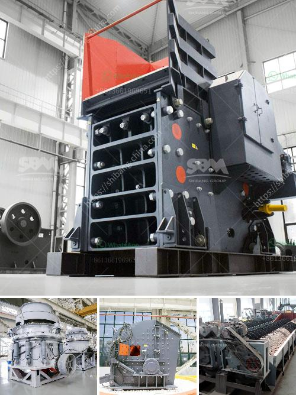

<h3>stone crusher plant list odisha</h3>
Stone crusher plant in Odisha is one of the leading businesses of Orissa. It is often associated with mining, crushing, and transportation activities. The stone crushing plant has been operating in the area for more than 30 years, providing crushed stone for both commercial and personal use.

The stone crusher plant is used for producing concrete, rock, and stone for construction purposes. The process involves several stages including crushing, screening, and washing. It takes large rocks or ore chunks and breaks them down into smaller pieces of various sizes. These smaller pieces are then used for construction purposes, such as building roads, making concrete, and laying foundations.

The stone crusher plant in Odisha is equipped with advanced technology and machinery, giving it an edge in the market. The plant also has a high production capacity, enabling it to produce a large quantity of crushed stone every day. This has made it a preferred supplier in the region.

Moreover, the stone crusher plant has several prominent features that make it stand out from other competitors. For example, it has a well-maintained fleet of vehicles and trucks for transportation, ensuring timely delivery of materials to customers. The plant also has a team of skilled workers who are trained in operating the machinery and ensuring the quality of the crushed stone.

The stone crusher plant in Odisha follows all relevant environmental regulations and guidelines, ensuring that the area remains safe and free from pollution. Additionally, the plant adheres to all safety protocols to ensure the well-being of its employees and visitors.

In conclusion, the stone crusher plant in Odisha plays a crucial role in providing crushed stone for construction purposes. It offers a reliable source of high-quality materials and adheres to all environmental and safety regulations. The plant's advanced technology and machinery enable it to meet the ever-increasing demand for crushed stone in the region.
<h3>Contact us</h3><ul><li><strong>Whatsapp:&nbsp;<a href="https://wa.me/8613661969651">+8613661969651</a></strong></li><li><a href="https://swt.shibang-china.com/?git&amp;zhl&amp;stone crusher plant list odisha"><strong>Online Service(chat now)</strong></a></li></ul><h3>Related</h3><ul><li><a href='ball mill price supplier.md'>ball mill price supplier</a></li><li><a href='ball mill manufacturers china.md'>ball mill manufacturers china</a></li><li><a href='diagram of a hammer mill machine.md'>diagram of a hammer mill machine</a></li><li><a href='lm vertical grinding mill.md'>lm vertical grinding mill</a></li><li><a href='basalt curb stone crusher price.md'>basalt curb stone crusher price</a></li></ul>