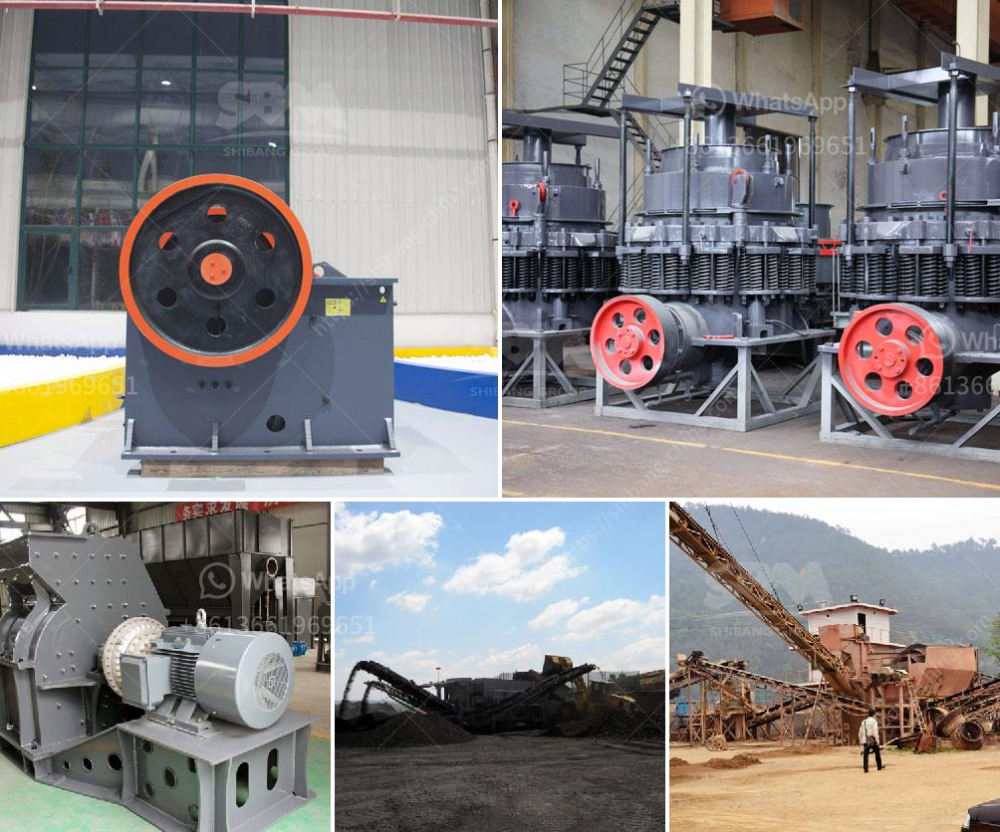

<h3>stone crusher plant tph layout</h3>
Stone crusher plant is a machine designed to reduce the large stone, granites, marble, lime rocks into the smaller size and output gravel, dust, different size of the material.

Stone crusher plants used worldwide. It is available with different-2 capacity, design, and utility. Uses of Crusher plant Stone crushing industry engaged in producing a crushed stone that used as a raw material for infrastructure projects like, road, highway, bridges, building canals, etc. All projects are considered as the core infrastructure work that gives the economy boom. Stone crusher units are not alone. Along with these plants, stone mining also associated. In fact, stone mining is the primary activity, and the crushing plant is the secondary activity that can be considered. Raw materials used for crushing unit Coal, Stone, Granite, limestone, Basalt, River stone, andesite calcite, abrasive rocks, glass, and ferrous material used for the crushing purpose. Stone Crusher plant Capacity The stone crusher plant will available from 50 TPH to 600 TPH (ton per hour). The plant can produce the 8 variants of material. Just to get the different variant material you also need to put the screening plant that just separates the different materials according to client or market demand. Stone Crusher plant works Raw Material processed through the vibrating feeder to crusher gradually and crusher crushed the material into respective pieces. From Crusher material conveyed to belt conveyor for secondary crushing before went on vibrating screen plant. Vibrating screen plant separates the quality and qualified material to final products. And unqualified material carried back to stone crusher and reprocesses it. Then again material went through the above process. The customer gets the required material according to the standard quality and different sizes. The product is used in industries of mining, construction material, highway, railway, water conservancy and chemical. Usually, in a whole production line, Ore Crusher Equipment is for first crushing. Working Principle of Stone Crusher plant The big rocks are smoothly fed into the jaw crusher by the feeder, and the crushed will be delivered into impact crusher for secondary crushing by belt conveyor, then screened by vibrating screen. For those unqualified materials, they will be delivered into impact crusher again for tertiary crushing. The sizes of finished product are 0-5mm, 5-10mm, 10-20mm, 20-30mm.

Stone crusher plant cost depends on quality, service, and the machines clients choose. in the future, as the development of mining industry, raw materials have to be crushed not only in mining and sand making industry, but also in chemical and construction industry. 300-500 TPH plants is a kind of medium and large-scale stone crushing planteffectively to crush limestone, coal, marble, quartz stone, river pebbles, iron ore, copper ore and so on, etc. Working principle of the stone crusher plant Vibrating feeder and vibrating screen combine with rough crusher and fine crusher in the stone crusher plant. There is Automax cone crusher which belongs to ore crusher, vertical crusher and the complete stone crusher plant also called portable crushing plant making up a complete crushing production line. The raw materials are sent to the jaw crusher for primary crushing through vibrating feeder, and then sent to the impact crusher for further crushing, and are comprehensively sent to the sand making machine for shaping by belt conveyor. After the shaping, the materials are generally relocated to the vibrating screen for screening to get the desired finished products. Stone crusher plant for coarse crushing up to 800 TPH. Stone crusher plant for sale from SBM is our star products. Articles Related Stone Crusher Plant Cost Stone Quarries and Crushers Stone Crusher Plant Job in India Stone Crushing Plant for Sale Stone Crusher Plant Manufacturer Rock Processing Lines Mobile Crusher Plant for Construction Waste

In conclusion, stone crusher plants are designed to do the job, hard-hitting work that offers a great deal of flexibility. Customers can select from the available range of machines that suits their needs the best. Articles can be written in 300-500 words that are informative and enjoyable to read.
<h3>Contact us</h3><ul><li><strong>Whatsapp:&nbsp;<a href="https://wa.me/8613661969651">+8613661969651</a></strong></li><li><a href="https://swt.shibang-china.com/?git&amp;zhl&amp;stone crusher plant tph layout"><strong>Online Service(chat now)</strong></a></li></ul><h3>Related</h3><ul><li><a href='150 ton per hour gold wash plant.md'>150 ton per hour gold wash plant</a></li><li><a href='grinding grinding equipment grinding.md'>grinding grinding equipment grinding</a></li><li><a href='limestone powder making plant ireland.md'>limestone powder making plant ireland</a></li><li><a href='aggregate crusher 200 meter capacity.md'>aggregate crusher 200 meter capacity</a></li><li><a href='sand washing plant south africa.md'>sand washing plant south africa</a></li></ul>