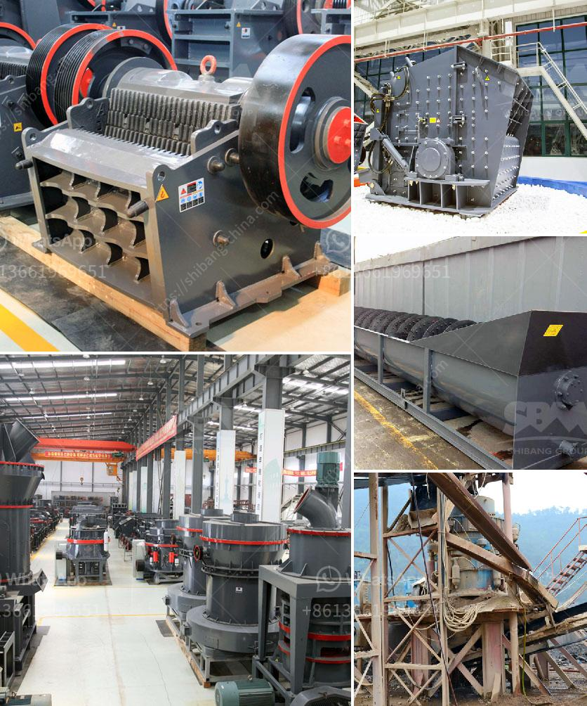

<h3>stone crusher price of 30 tons per hour</h3>
Stone crusher is a kind of mining machinery and equipment with functions of crushing ore after coarse crushing process. It has the following advantages: high crushing ratio, even final product size, simple structure, reliable operation, convenient maintenance, and low cost.

The main reason why customers choose to buy 30 tons per hour stone crusher is the low cost. The 30 tons per hour stone crushing and screening plant is mainly consisting of stone crusher, vibrating screen, belt conveyor and control system, etc.

There are mainly three types of stone crushers in the market: jaw crusher, cone crusher and impact crusher. The price of these stone crushers varies from different types. With high crushing capacity, outstanding performance, robust design and low wear consumption, SBM 30 tons per hour stone crusher is definitely a good choice for small scale granite crushing plant.

Jaw crusher is commonly used as the primary crushing device for the granite stone fragments. Its feeding size is no more than 350mm. When the discharging size is less than 40mm, it usually requires a sand making machine for fine crushing. Just as the stone crusher price is not the same, cone crusher and other sand making machine processing capacity has a little difference.

Because each kind of stone crusher has its own advantages and operating costs, it is important for customers to choose an ideal and suitable stone crusher. The mining machinery manufacturers need to have highlight long-term cooperation and step up research and development, in order to create a brighter future.

In addition, the hydraulic cone crusher machine has the superior performance, convenient use and low maintenance costs. Cone crusher is widely applied in metallurgy, construction, road building, chemical and phosphatic industry. It makes a great contribution to the mineral processing industry. So the price of cone crusher is also higher than other types.

To sum up, the price of a stone crusher with a capacity of 30 tons per hour is not high, but it is not low due to the different type, scale and processed materials. The output requirement, investment budget, maintenance and repair requirements also affect the price to different degrees.

If you want to get cheap price, you need to know some tips to choose the product. First, carefully analyze the different types and specifications, and then choose the appropriate one according to your actual situation. Second, visit multiple manufacturers, compare the price, quality, and service content. Choose the most reliable and cost-effective one. Third, you can also choose to directly buy construction waste crusher online, where the price is generally lower.

In conclusion, when purchasing 30 tons per hour stone crusher, customers must choose the suitable type of stone crusher according to their output requirements, investment budget, and actual production requirements. It is recommended that they do a good job of market research in advance, and compare the quality, price, and service content of multiple manufacturers to make a wise choice.
<h3>Contact us</h3><ul><li><strong>Whatsapp:&nbsp;<a href="https://wa.me/8613661969651">+8613661969651</a></strong></li><li><a href="https://swt.shibang-china.com/?git&amp;zhl&amp;stone crusher price of 30 tons per hour"><strong>Online Service(chat now)</strong></a></li></ul><h3>Related</h3><ul><li><a href='crusher peru price.md'>crusher peru price</a></li><li><a href='vertical mill for sale.md'>vertical mill for sale</a></li><li><a href='price of hammer mill.md'>price of hammer mill</a></li><li><a href='quartz stone crushing milling.md'>quartz stone crushing milling</a></li><li><a href='jaw crusher specification for activated carbon.md'>jaw crusher specification for activated carbon</a></li></ul>