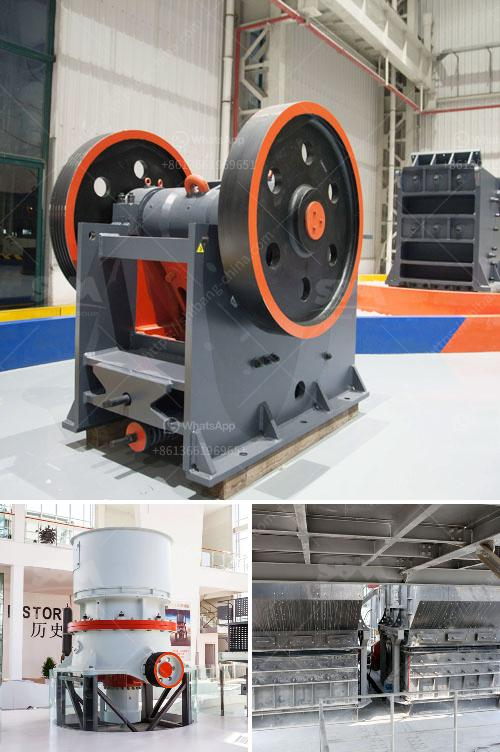

<h3>stone crusher punjab ropar</h3>
Stone crushing industry is a dominant but still environmentally unorganized sector in Pakistan. Its different operations cause significant environmental impacts including air and noise pollution in the vicinity as well as vibration effects far-off from the source. The entire district of Ropar in Punjab has been affected by this industry, particularly along the banks of the Sutlej River.

Ropar is known for its stone crushers, as it has a total of 500 stone crushers operating in the vicinity of the district. The illegal mining and transportation of stones have wreaked havoc on the environment, leading to adverse impacts on the agriculture and biodiversity of the area.

The stone crushers contribute significantly to the escalating air and noise pollution levels in the surrounding areas. During the operation of these crushers, large amounts of dust and particulate matter are released into the air, which can cause respiratory problems and other health issues among the local population. The constant noise produced by the crushers also adds to the distress of the residents and disrupts their everyday life.

The stone crushing industry also has adverse effects on the aquatic biodiversity of the Sutlej River. The excessive extraction of stones from the riverbed disrupts its natural flow, leading to erosion of the riverbanks and loss of valuable ecosystems. Moreover, the stone dust and pollutants that are released during the crushing process find their way into the river, resulting in water pollution and the destruction of aquatic life.

The stone crushing industry in Ropar is also responsible for the contamination of agricultural land. The dust and pollutants released from the crushers settle on the nearby agricultural fields, making them infertile and unsuitable for cultivation. This has a direct impact on the livelihoods of the local farmers who depend on agriculture for their sustenance.

In addition to the environmental impacts, the stone crushing industry in Ropar also operates without adhering to the necessary regulations and guidelines. Many of these crushers are illegal and operate without obtaining the required permits and licenses. This not only undermines the rule of law but also leads to the loss of potential revenue for the government.

Considering the severity of the situation, it is imperative for the government to take serious measures to address the issues related to the stone crushing industry in Ropar. Strict enforcement of regulations, such as the installation of pollution control equipment, regular monitoring of the crushers, and imposition of heavy fines for non-compliance, should be implemented.

Moreover, alternative solutions should be explored to reduce the dependency on stone crushers for construction purposes. Promoting the use of eco-friendly building materials and encouraging sustainable construction practices can help reduce the demand for stones extracted from the riverbed, thereby mitigating the negative impacts on the environment.

It is the collective responsibility of the government, industry stakeholders, and the local community to work together towards sustainable development. Efforts should be made to strike a balance between economic growth and environmental conservation. Only through such collaborative efforts can we ensure the preservation of the natural resources and biodiversity of Ropar for future generations.
<h3>Contact us</h3><ul><li><strong>Whatsapp:&nbsp;<a href="https://wa.me/8613661969651">+8613661969651</a></strong></li><li><a href="https://swt.shibang-china.com/?git&amp;zhl&amp;stone crusher punjab ropar"><strong>Online Service(chat now)</strong></a></li></ul><h3>Related</h3><ul><li><a href='screen vibrating screen for sand.md'>screen vibrating screen for sand</a></li><li><a href='clay mill machine crusher price.md'>clay mill machine crusher price</a></li><li><a href='jaw crusher price capacity.md'>jaw crusher price capacity</a></li><li><a href='total power for jaw crusher 500 tph.md'>total power for jaw crusher 500 tph</a></li><li><a href='jaw crusher machine supplier.md'>jaw crusher machine supplier</a></li></ul>