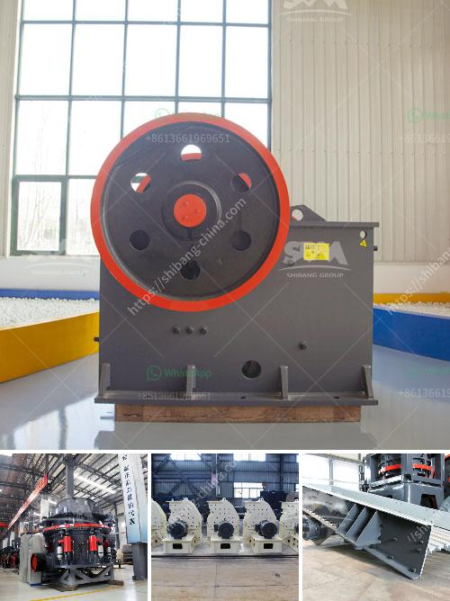

<h3>stone crusher usa</h3>
Stone crusher USA is a significant industrial sector in the country engaged in producing crushed stone which acts as raw material for various construction activities such as the creation of roads, bridges, buildings, etc. It is estimated that there are over 12,000 stone crusher units in the state of United States. The demand for stone crusher machine is also quite high in the country due to the rapid urbanization and growing industrialization.

The process of stone crushing differs from each other based on the availability of raw material and the requirement of the end product. Generally, the stone crushing plant is composed of feeder machine, stone crusher, screening machine, belt conveyor, and centralized control system, etc. The raw materials are usually brought from the mining site into the stone crusher plant for passing them through various crushing stages to produce different sizes of stone aggregates required for different construction purposes.

There are various types of stone crushers in USA to cater to different construction needs. These crushers include jaw crusher, impact crusher, cone crusher, hammer crusher, and mobile crusher. Different crushers are used depending on the nature of the specific construction project. Jaw crushers are ideal for primary crushing, while impact crushers and cone crushers are used for secondary and tertiary crushing.

The stone crusher USA offers several advantages in terms of cost-effectiveness, reliability, and durability. One of the main advantages is the ability of the stone crusher to produce a wide range of products with different specifications and sizes. This flexibility allows the construction industry to use stone crushers for various projects without the need for additional crushers.

Additionally, stone crushers are capable of processing a variety of materials, including hard rocks, ores, granite, limestone, and concrete. This versatility makes them suitable for various construction projects, irrespective of the composition of the raw materials.

Stone crusher USA plays a vital role in the construction industry. The demand for crushed stone is increasing rapidly due to the development of infrastructure, making the stone crusher industry a key player in the economy. With its various types and advantages, stone crushers have become an essential tool for construction purposes.

However, it is important to ensure that stone crushing activities are carried out in an environmentally responsible manner. Dust control measures, noise reduction techniques, and waste management should be implemented to minimize the impact on the environment and the health of workers. Additionally, regular maintenance and inspection of stone crushers are crucial to ensure their efficient performance and longevity.

Overall, stone crusher USA is an essential part of the construction industry and its development should be regulated and monitored to promote sustainable construction practices.
<h3>Contact us</h3><ul><li><strong>Whatsapp:&nbsp;<a href="https://wa.me/8613661969651">+8613661969651</a></strong></li><li><a href="https://swt.shibang-china.com/?git&amp;zhl&amp;stone crusher usa"><strong>Online Service(chat now)</strong></a></li></ul><h3>Related</h3><ul><li><a href='quartz grinding ball mill working.md'>quartz grinding ball mill working</a></li><li><a href='pebble and basalt production line in panama.md'>pebble and basalt production line in panama</a></li><li><a href='gypsum powder suppliers in india.md'>gypsum powder suppliers in india</a></li><li><a href='potash ore crusher.md'>potash ore crusher</a></li><li><a href='hard rock aggregates plant.md'>hard rock aggregates plant</a></li></ul>