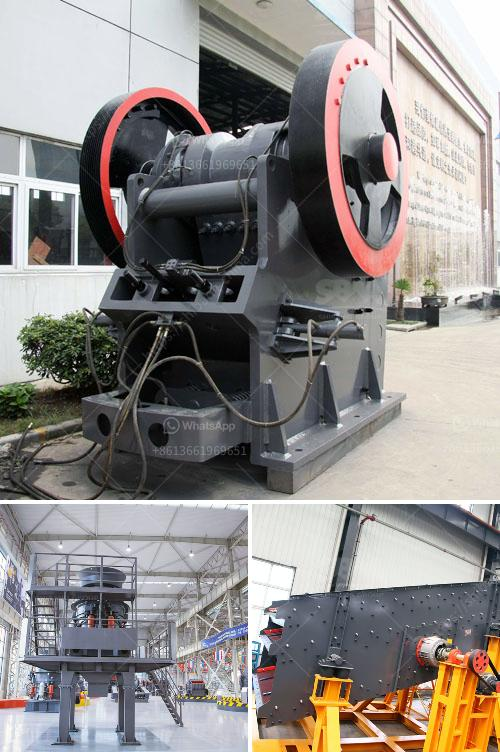

<h3>stone crusher used machinery for sale in india</h3>
Stone crusher is a machine designed to reduce large rocks into smaller rocks, gravel, or rock dust. Crushers may be used to reduce the size, or change the form, of waste materials so they can be more easily disposed of or recycled, or to reduce the size of a solid mix of raw materials, so that pieces of different composition can be differentiated. Crushing is the process of transferring a force amplified by mechanical advantage through a material made of molecules that bond together more strongly, and resist deformation more, than those in the material being crushed do.

Used crushers are basically of three types; namely, Cone crusher, Jaw crusher, and Impact crusher. The main objective is to design impact stone crusher. Impact stone crusher involves the use of impact rather than pressure to crush materials. The material is held within a cage, with openings of the desired size at the bottom, end or at sides to allow crushed material to escape through them. Impact stone crusher is used with soft materials, medium to hard stones and medium hard metallic ores.

The principles used for impact loading are the time duration of impact, the impact velocity, and the energy available per unit mass. The main objective of particle size reduction methods is to produce desired particle size with maximum productivity and minimum wear rate of the crusher. Machine design parameters such as vibration, noise and durability of a machine is directly proportional to the crushing horsepower and inversely proportional to the crushing efficiency.

However, during the crushing process, jaw crusher may produce a large amount of dust, which will cause terrible environmental pollution. With the step by step follow-up of environmental supervision, it is urgent to solve the dust problem.

At present, dust-proof devices mainly include mechanical dust-proof devices, water spray dust removal devices, and other tube-shaped solid dust-proof devices, on the one hand, in the aspect of design, it adopts the design of dust-proof plate which make the powder falling and reducing the impact on the material damage; on the other hand, it adopts some sealing measures to prevent the dust from overflowing in the crushing chamber, which improves the degree of sealing and reduces the occurrence of dust.

In conclusion, stone crushers are essential equipment in mining and stone quarry site. In stone quarry, stone crushers are used to crush stones into small particle size or change the form such as basalt, granite, limestone, quartz, marble, for building aggregates, artificial sand production and recycle building waste materials such as debris, a heap of asphalt or concrete. In India, stone crusher machines have been widely used since its inception, enjoying tremendous popularity. Good manufacturer can promise the quality of the machine and solve all problems encountered during the operation on the basis of stone breakers for sale in India.
<h3>Contact us</h3><ul><li><strong>Whatsapp:&nbsp;<a href="https://wa.me/8613661969651">+8613661969651</a></strong></li><li><a href="https://swt.shibang-china.com/?git&amp;zhl&amp;stone crusher used machinery for sale in india"><strong>Online Service(chat now)</strong></a></li></ul><h3>Related</h3><ul><li><a href='small scale gold mining equipment in south africa.md'>small scale gold mining equipment in south africa</a></li><li><a href='jaw crusher capacity.md'>jaw crusher capacity</a></li><li><a href='denver ball mills.md'>denver ball mills</a></li><li><a href='used stone crasher machine for sale.md'>used stone crasher machine for sale</a></li><li><a href='manganese crushing machine in china.md'>manganese crushing machine in china</a></li></ul>