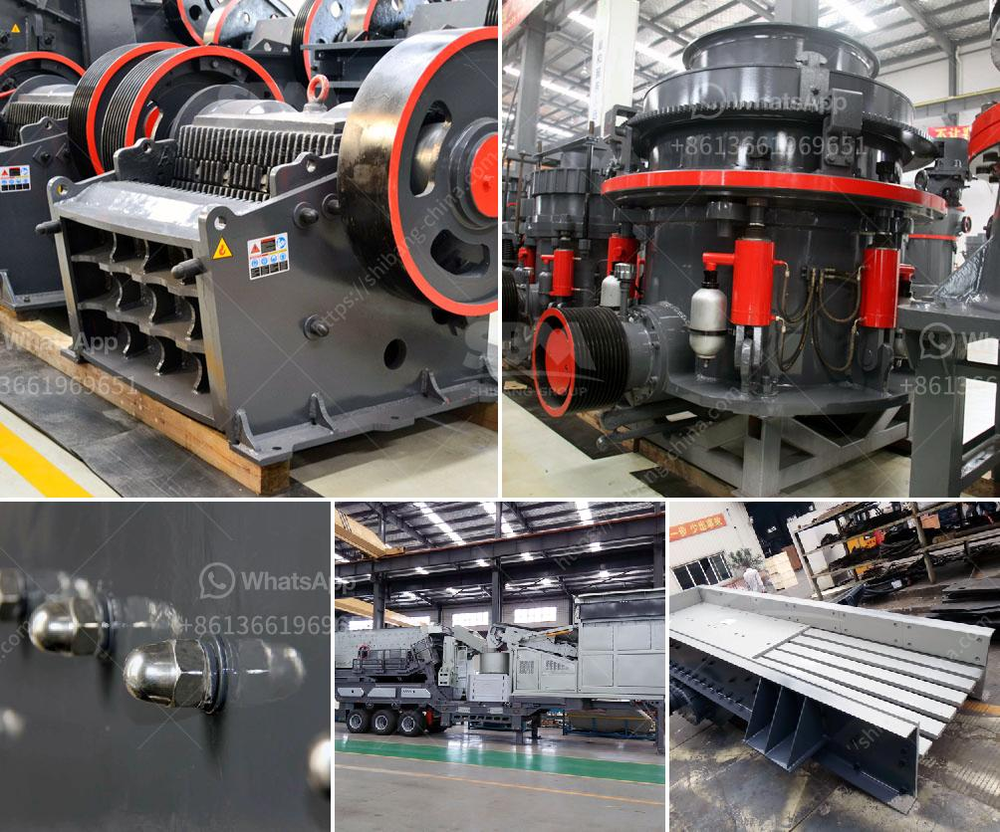

<h3>stone crushers in atlantico</h3>
Stone crushing is a crucial industry in Atlantico, a department located in the northern part of Colombia. The region boasts abundant natural resources, including stone, which is mined and transformed into construction materials. Stone crushers play a significant role in processing these raw materials and converting them into usable aggregates for construction projects.

Stone crushers are machines designed to break large rocks into smaller rocks, gravel, sand, or rock dust. They are widely used in various sectors such as mining, construction, building, and infrastructure development. In Atlantico, stone crushers are an essential part of the local economy as they provide employment opportunities and contribute to the overall development of the region.

The extraction and crushing of stone in Atlantico follow a systematic process that begins with the identification of suitable stone deposits. Geologists and mining companies survey the area to locate sites with high-quality stone formations. Once a source is found, the extraction process begins, where large machinery extracts and transports the raw material to the crushing facilities.

Stone crushing plants in Atlantico consist of different components, including feeders, crushers, conveyors, and screens. The stone is initially fed into the primary crusher, which breaks it down into smaller pieces. Subsequently, secondary and tertiary crushers further reduce the stone size. These crushers use different mechanisms, such as impact, compression, or attrition to achieve the desired shape and size of the aggregates.

After the crushing process, the stone goes through a series of screens that separate it into different sizes. The graded aggregates are then transported via conveyor belts to storage areas or directly to the construction site. Stone crushers are equipped with highly efficient and powerful engines to ensure a continuous and smooth crushing process.

The use of stone crushers in Atlantico is essential for meeting the growing demand for construction materials. The aggregates produced are used in various applications, including road construction, building foundations, and concrete production. With the increasing urbanization and infrastructure development in the region, the demand for stone products continues to rise.

However, stone crushing is not without environmental concerns. The dust generated during the crushing process can pose health risks to the workers and nearby communities. Therefore, stone crushing plants in Atlantico have implemented various measures to mitigate these issues. Dust control systems, water sprays, and enclosures are installed to minimize dust emissions. Additionally, proper training and protective equipment are provided to workers to ensure their safety.

In conclusion, stone crushers play a vital role in the stone mining and construction industry in Atlantico. They enable the extraction and processing of raw materials, which are crucial for the development of the region. While the industry contributes significantly to the economy, it is essential to prioritize environmental and worker safety concerns to ensure sustainable and responsible stone crushing practices.
<h3>Contact us</h3><ul><li><strong>Whatsapp:&nbsp;<a href="https://wa.me/8613661969651">+8613661969651</a></strong></li><li><a href="https://swt.shibang-china.com/?git&amp;zhl&amp;stone crushers in atlantico"><strong>Online Service(chat now)</strong></a></li></ul><h3>Related</h3><ul><li><a href='crusher machine discount.md'>crusher machine discount</a></li><li><a href='crushers for sale south africa.md'>crushers for sale south africa</a></li><li><a href='ore crusher copper ore crusher.md'>ore crusher copper ore crusher</a></li><li><a href='vsi crusher for crush sand.md'>vsi crusher for crush sand</a></li><li><a href='limestone vertical mill.md'>limestone vertical mill</a></li></ul>