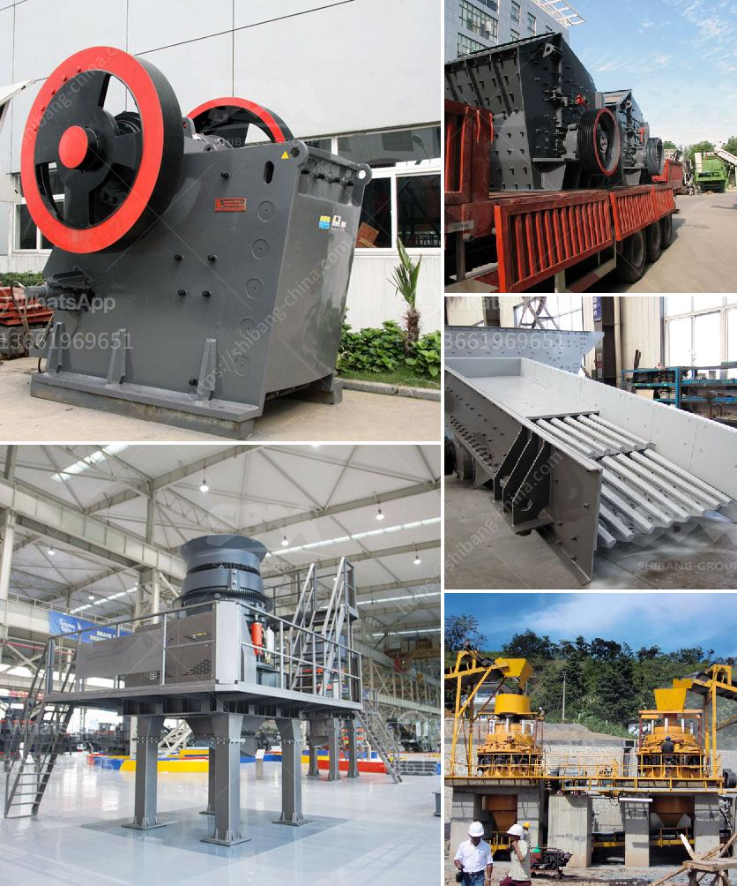

<h3>stone crushers in belen</h3>
Belen, a small town in New Mexico, is home to various enterprises that contribute to the state's economic growth. Among these industries, stone crushing is a crucial one that supports the construction, infrastructure development, and manufacturing sectors in the locality. Stone crushers play a significant role in the extraction and processing of raw materials necessary for various construction activities. Let's delve into the world of stone crushers in Belen and understand their importance.

The primary function of stone crushers is to break down large rocks or stones into smaller pieces that can be used for construction purposes. These machines employ a combination of mechanical forces, such as compression, impact, and shear, to achieve this task. With technological advancements, stone crushing machinery has become more efficient and capable of producing different sizes of aggregates required in construction projects.

One of the primary uses of stone crushers is in road construction. The crushed stones are used as a foundation material for building strong and durable highways, streets, and local roads. The crushed aggregates also work as an excellent base for asphalt and concrete surfaces, ensuring their longevity and structural integrity.

Aside from road construction, stone crushers are essential in building residential and commercial structures. The crushed stones are commonly used as a component in concrete mixtures, providing strength and stability to the structures. Additionally, stone crushers produce various sizes of stones, which are utilized in the production of bricks, blocks, and tiles. The availability of locally sourced construction materials reduces the overall cost of construction projects in Belen.

Furthermore, stone crushers play a vital role in infrastructure development within the town. Infrastructure projects, such as bridges, tunnels, and dams, require a steady supply of high-quality aggregates. Local stone crushers in Belen fulfill this demand by extracting and crushing rocks from nearby quarries. This local sourcing of raw materials not only supports local businesses but also minimizes transportation costs and reduces carbon emissions.

Apart from providing essential materials for construction, the stone crushing industry in Belen also generates employment opportunities for the local population. Stone crushers require skilled operators to operate the machinery efficiently and safely. In addition, the industry creates indirect employment for individuals involved in related activities, such as maintenance and repair services for stone crushing equipment. The availability of jobs helps to stabilize the local economy and raises the standard of living for residents.

However, it is crucial to ensure that stone crushing activities are carried out in an environmentally responsible manner. Local stone crushers in Belen must comply with regulations regarding air and water quality, noise pollution, and the sustainable extraction of raw materials. Regular monitoring and compliance with environmental guidelines ensure the longevity and sustainable growth of the industry, while also preserving the natural beauty of Belen.

In conclusion, stone crushers in Belen are a crucial industry that supports construction, infrastructure development, and manufacturing in the region. The extraction and processing of raw materials provide essential resources for road construction, building projects, and infrastructure development. The industry's contribution to employment generation and the local economy is significant. With proper regulations in place, the stone crushing industry in Belen will continue to thrive, fostering economic growth and sustainable development in the region.
<h3>Contact us</h3><ul><li><strong>Whatsapp:&nbsp;<a href="https://wa.me/8613661969651">+8613661969651</a></strong></li><li><a href="https://swt.shibang-china.com/?git&amp;zhl&amp;stone crushers in belen"><strong>Online Service(chat now)</strong></a></li></ul><h3>Related</h3><ul><li><a href='economic analysis of conveyor system.md'>economic analysis of conveyor system</a></li><li><a href='crusher for pozzolana.md'>crusher for pozzolana</a></li><li><a href='stone crushing machine factories.md'>stone crushing machine factories</a></li><li><a href='sand dry vacuum machine truk.md'>sand dry vacuum machine truk</a></li><li><a href='difference between underground and open cast mining.md'>difference between underground and open cast mining</a></li></ul>