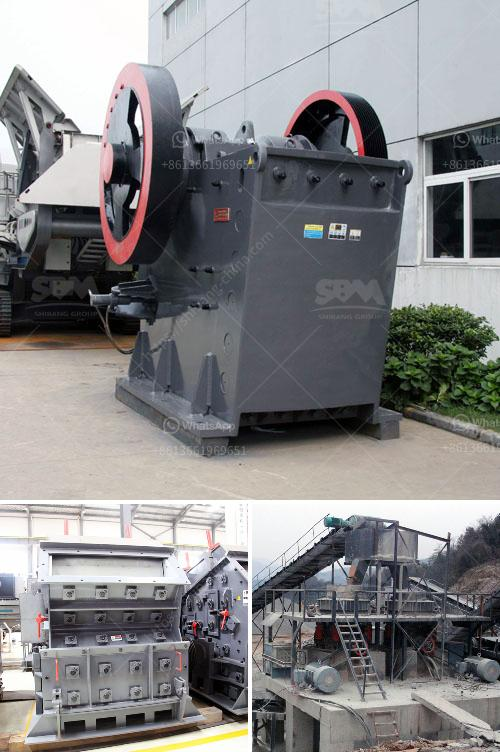

<h3>stone crushers in botswana</h3>
Botswana, a landlocked country in Southern Africa, has a flourishing mining industry. Mining is one of the pillars of the country's economy, contributing significantly to its GDP. In recent years, Botswana has experienced a surge in the number of stone crushers operating in the country. The crushing industry is a significant contributor to the mining sector, which boasts lucrative diamond and coal reserves. However, stone crushers also pose environmental and health risks to the local population. 

Stone crushers are machines designed to break large rocks into smaller pieces, gravel, or rock dust. They are commonly used in a variety of industries, including mining, construction, and aggregate production. These machines are essential for mining operations, as they help extract valuable minerals from the earth's surface. In Botswana, stone crushers are primarily used for crushing stones or rocks into smaller sizes to be used for construction purposes.

The mining industry in Botswana has witnessed tremendous growth over the years, attracting foreign investment and creating job opportunities for the local population. However, the rapid expansion of the mobile stone crushing sector has raised concerns about the environment and public health. The primary issue is the dust generated during the stone crushing process.

The process of stone crushing produces a considerable amount of dust, which can be harmful to human health and the environment. Exposure to fine particulate matter, such as dust, can lead to respiratory disorders, cardiovascular problems, and other health complications. Additionally, the dust can settle on vegetation, degrading air quality and hindering photosynthesis, the primary process by which plants convert sunlight into energy.

Furthermore, the noise pollution generated by stone crushers can be a nuisance to the local population. Prolonged exposure to high noise levels can cause hearing impairment, stress, sleep disturbances, and other health issues. For communities living near stone crushers, the relentless noise can significantly impact their quality of life.

To mitigate these environmental and health risks, the government of Botswana needs to implement stringent regulations and enforce them effectively. Legislation should be passed to enforce the use of dust suppression measures at stone crushing sites. These measures may include installing water sprays or enclosed screening equipment to control the spread of dust particles. Additionally, stone crushers should be located away from residential areas to minimize the impact of noise pollution on nearby communities.

Furthermore, environmental impact assessments should be conducted before the establishment of new stone crushing facilities. These assessments can evaluate potential environmental and health risks and suggest preventive measures. Public awareness programs are also essential to educate the local population about the risks associated with stone crushers and promote responsible mining practices.

Stone crushers indeed play a crucial role in the mining industry, facilitating the extraction of valuable minerals. However, it is imperative to strike a balance between economic growth and environmental protection. The government and mining companies should work together to ensure that the stone crushing industry adheres to strict regulations and implements sustainable practices. By doing so, Botswana can continue to reap the benefits of its mining sector while safeguarding the well-being of its citizens and the environment.
<h3>Contact us</h3><ul><li><strong>Whatsapp:&nbsp;<a href="https://wa.me/8613661969651">+8613661969651</a></strong></li><li><a href="https://swt.shibang-china.com/?git&amp;zhl&amp;stone crushers in botswana"><strong>Online Service(chat now)</strong></a></li></ul><h3>Related</h3><ul><li><a href='difference between underground and open cast mining.md'>difference between underground and open cast mining</a></li><li><a href='200tph old cone crusher plant india hyderabad.md'>200tph old cone crusher plant india hyderabad</a></li><li><a href='grinder machine for quartz.md'>grinder machine for quartz</a></li><li><a href='small cement plant for sale.md'>small cement plant for sale</a></li><li><a href='argentine hammer mill.md'>argentine hammer mill</a></li></ul>