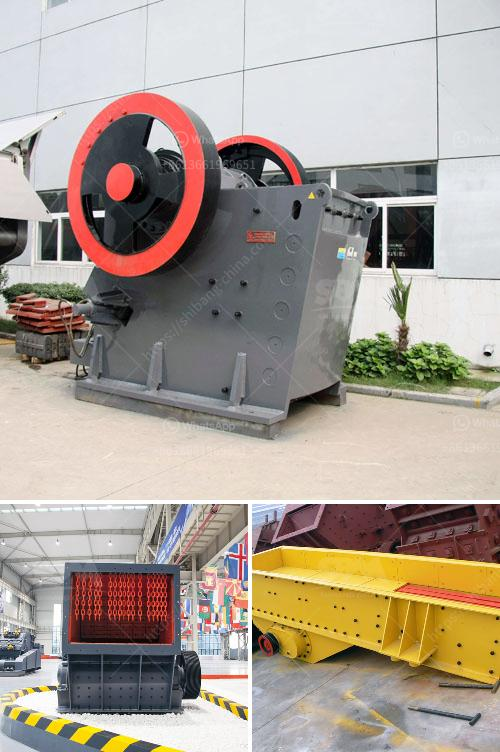

<h3>stone crushers industries in west bengal</h3>
Stone crushers industries in West Bengal have rapidly grown over the past few years due to increasing demand from the construction industry. The rising demand for infrastructure development and expanding the road network across the state is driving the industry's growth and providing lucrative opportunities for the stone crusher manufacturers. With crushing capacities ranging from 50 TPH to 1000 TPH, they cater to a wide range of customers, including real estate developers, builders, and individual home builders.

West Bengal is known for its rich mineral resources, especially in the Birbhum district where there are approximately 250 stone crushers actively operating in the region. The district also has a high concentration of stone quarries and crushers established in the vicinity. These industries have a significant impact on the local economy, providing employment opportunities to a large number of people, both directly and indirectly.

Stone crushers play a crucial role in the production of aggregates needed for construction projects. The industry uses different types of crushers to fulfill the various crushing requirements of different construction materials. For example, jaw crushers are ideal for primary crushing applications, while cone crushers are suitable for secondary and tertiary crushing. Impact crushers are used for crushing brittle materials with low to medium hardness. These crushers reduce the rock size to a smaller and more manageable size for further processing.

The stone crushers industry in West Bengal is characterized by several operational challenges such as low productivity, suboptimal feed size distribution, and inadequate capital investment. To address these issues, stone crusher manufacturers are investing in technological advancements to increase productivity and improve efficiencynn.

Moreover, the industry faces environmental concerns with respect to dust pollution. The stone crushing process generates a substantial amount of dust, which can lead to health hazards, respiratory issues, and environmental degradation. The industry needs to adopt effective dust suppression measures such as water sprinklers, mist spray systems, and enclosing the crusher units to minimize the dust emission during the crushing process.

Going forward, the stone crushers industry in West Bengal is expected to witness further growth due to the increasing infrastructure projects and the availability of raw materials. The state government's focus on building robust road networks and improving connectivity will be a driving force for the industry. Additionally, the government's initiatives to streamline the approval process and provide necessary infrastructure support are encouraging more investments in the sector.

To ensure sustainable growth and mitigate the environmental impact, the industry stakeholders should collaborate with regulatory bodies and adopt best practices for responsible mining and crushing operations. Encouraging the use of eco-friendly technologies and equipment could also contribute toward reducing the industry's carbon footprint.

In conclusion, the stone crushers industry in West Bengal is witnessing rapid growth fueled by increasing demand from the construction sector. However, the industry needs to address operational challenges and implement sustainable practices to ensure responsible growth while minimizing its impact on the environment. With continued government support and industry collaboration, the stone crushers industry in West Bengal can contribute significantly to the state's economic development in the years to come.
<h3>Contact us</h3><ul><li><strong>Whatsapp:&nbsp;<a href="https://wa.me/8613661969651">+8613661969651</a></strong></li><li><a href="https://swt.shibang-china.com/?git&amp;zhl&amp;stone crushers industries in west bengal"><strong>Online Service(chat now)</strong></a></li></ul><h3>Related</h3><ul><li><a href='mini concrete crusher hire high wycombe.md'>mini concrete crusher hire high wycombe</a></li><li><a href='vertical mill for sale.md'>vertical mill for sale</a></li><li><a href='cement vertical roller mill price in india.md'>cement vertical roller mill price in india</a></li><li><a href='quarry crusher equipment supplier.md'>quarry crusher equipment supplier</a></li><li><a href='list of crushers companies in malaysia.md'>list of crushers companies in malaysia</a></li></ul>