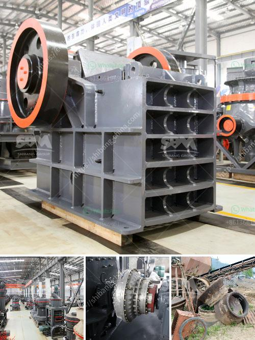

<h3>stone crushers machinery in south africa</h3>
Stone crushers are extensively used in the mining, construction, and building material industries. Stone crushers are primarily small scale industries in early time, mostly owned and operated by less educated individuals and are scattered all over the country. The small stone crushing industry mainly includes the various types of stone crusher machines in South Africa.

The types of stone crushers are cone crusher, jaw crusher, impact crusher, and mobile rock crushing. We supply cost-effective products and first-class service, solutions, support for customers. Our factory has an area of 10000 square meters, USD 1000 million fixed assets, and the engineer and technical personnel covering 15% of the total staff. To build a factory for the production and export of China's top mining machinery is our goal.

Stone crushers from our factory include jaw crusher, impact crusher, cone crusher, hammer crusher, double roller crusher, ring hammer crusher, vertical shaft impact crusher, cone crusher, bowl liner, and impact liner. We provide one-stop service for all kinds of crusher machinery and spare parts.

Stone crusher machines are widely utilized in mining, metallurgy, building materials, highway, railway, water conservancy, chemical, and many other departments. It can crush various materials with compressive strength below 320Mpa. Such as quartz, granite, basalt, limestone, river stone, sandstone, shale, iron ore, copper ore, gold ore, etc.

Low price stone crusher in South Africa : jaw crusher, impact crusher, spring cone crusher, tire crusher, crawler crusher, mobile crusher, vibrating feeder, vibrating screen, etc.

Stone crusher machinery parts : bolts & nuts with washer, 2nos(6 x 1 ), 1nos(5/8 x 1 1/2),2nos(5/8 x 2),6nos(3/4 x 3 1/4),1no(7/8 x 6) along with tank and motor

Our aftersales service personnel have a strong team comprised of engineers and technicians who can provide assistance and guidance in a timely manner. We believe that professional, efficient, and timely aftersales service is crucial in enhancing customers' satisfaction. We provide comprehensive services, including training, installation, commissioning, and maintenance. Our well-trained technicians can also offer field service and troubleshooting support.

Stone crushers are vital pieces of equipment that help in the production of smaller rocks into a usable aggregate material. They are a highly efficient tool for any construction or mining project and can significantly reduce the time and effort required. Stone crushers machinery is available in various sizes and capacities, depending on the nature of the job and the required output. It is important to choose a reliable and experienced stone crusher machinery manufacturer and exporter in South Africa. Considering the high-power requirements of mining and construction, these machines are excellent for crushing huge rocks into a fine aggregate, which helps in reducing further operational costs, ensuring faster output, and higher production.
<h3>Contact us</h3><ul><li><strong>Whatsapp:&nbsp;<a href="https://wa.me/8613661969651">+8613661969651</a></strong></li><li><a href="https://swt.shibang-china.com/?git&amp;zhl&amp;stone crushers machinery in south africa"><strong>Online Service(chat now)</strong></a></li></ul><h3>Related</h3><ul><li><a href='aggregate washing screens in south africa.md'>aggregate washing screens in south africa</a></li><li><a href='dolomite powder grinding mill in india.md'>dolomite powder grinding mill in india</a></li><li><a href='kaolin mill machine 400 mesh.md'>kaolin mill machine 400 mesh</a></li><li><a href='stone crusher machine dubai.md'>stone crusher machine dubai</a></li><li><a href='crusher processing machines nigeria.md'>crusher processing machines nigeria</a></li></ul>