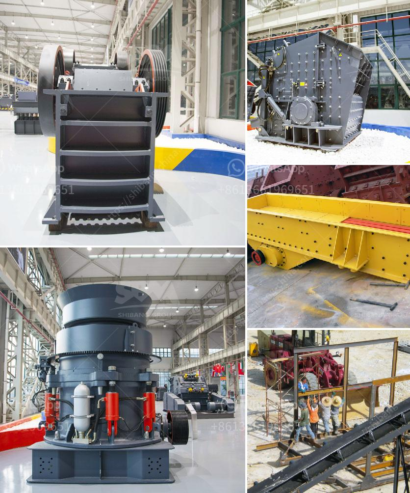

<h3>stone crushers made in greece</h3>
Stone crushing machines have been around for decades, and they have been used by miners, quarries, and contractors around the world. In Greece, the use of stone crushers dates back to ancient times, as olive oil was essential for the Greek economy. That is why the Greeks used these machines to extract olive oil centuries ago.

Stone crushers are machines designed to reduce large rocks into smaller rocks, gravel, or rock dust. They are used to reduce the size or change the form of waste materials so that they can be easily disposed of or recycled. These machines have a primordial role in the construction industry as they are used to crush stones and rocks into smaller sizes necessary for various purposes.

Greek stone crushers are known for their exceptional durability and reliability. These machines are made using high-quality materials and are designed to withstand the rugged conditions and harsh environments of the mining and construction industries. They are equipped with powerful motors, which provide the necessary force to crush the stones effectively. Additionally, these machines are highly flexible, allowing them to be used in various applications such as road constructions, building foundations, and railway ballast.

Stone crushers made in Greece are also known for their efficiency. These machines can process a large amount of rocks and stones in a short period, making them highly productive. The specialized design of the crushing chamber and the high rotational speed of the rotor ensure that the stones are crushed into the desired size quickly and efficiently. This results in enhanced productivity and reduced downtime, saving both time and money for the operators.

In conclusion, stone crushers made in Greece have played a significant role in the construction and mining industries for centuries. With their exceptional durability, reliability, and efficiency, they have been essential tools for extracting olive oil and crushing various materials. As technology continues to advance, stone crushers will undoubtedly continue to evolve to meet the ever-increasing demands of the industry, thereby solidifying their place as indispensable equipment for the global construction and mining sectors.
<h3>Contact us</h3><ul><li><strong>Whatsapp:&nbsp;<a href="https://wa.me/8613661969651">+8613661969651</a></strong></li><li><a href="https://swt.shibang-china.com/?git&amp;zhl&amp;stone crushers made in greece"><strong>Online Service(chat now)</strong></a></li></ul><h3>Related</h3><ul><li><a href='ballast processing machine.md'>ballast processing machine</a></li><li><a href='cost of a primairy crusher.md'>cost of a primairy crusher</a></li><li><a href='processing of calcium carbonate.md'>processing of calcium carbonate</a></li><li><a href='sand washinng plant makers in srilanka.md'>sand washinng plant makers in srilanka</a></li><li><a href='quarry machine and crusher plant sale in australia.md'>quarry machine and crusher plant sale in australia</a></li></ul>