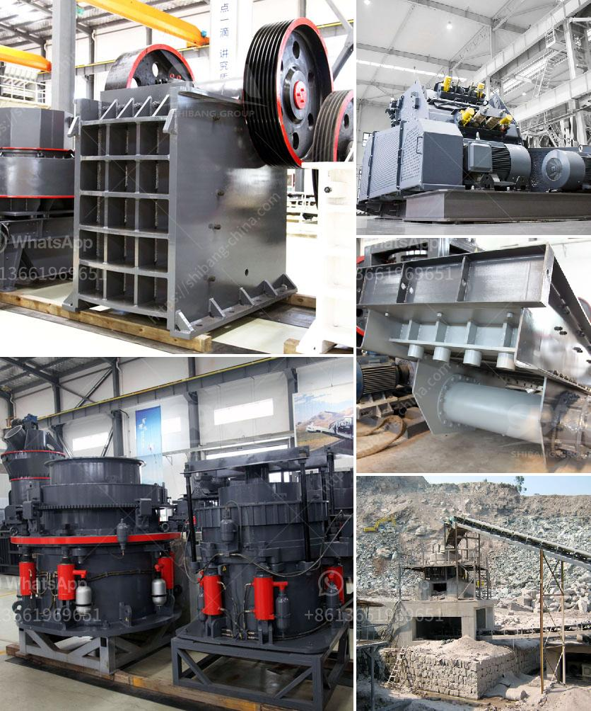

<h3>stone crushers mozambique</h3>
Stone crushers are widely used in mining, metallurgy, building materials, highways, railways, water conservancy and chemical industries. They thrive in areas where there is demand for gravel or sand. Mozambique, located in Southeast Africa, has a rich reserve of natural resources such as limestone, graphite, iron ore, titanium, and gemstones. These resources are essential for various infrastructure projects and industrial development in the country.

Stone crushers play a pivotal role in the mining industry in Mozambique. They efficiently break down large stones into smaller, more manageable sizes, making them suitable for construction and roadwork projects. Stone crushers use high-pressure mechanical force to break down these stones into smaller pieces. This process is facilitated by the use of state-of-the-art technology, ensuring efficiency and reducing the amount of manual labor required.

Moreover, stone crushers in Mozambique are equipped with engines that are designed to be environmentally friendly. They minimize noise pollution and reduce emissions of harmful gasses, making them more sustainable compared to traditional machinery.

The demand for stone crushers in Mozambique is growing rapidly due to the country's increasing infrastructure development and mining activities. These machines have become a crucial asset for construction companies and contractors, allowing them to handle large rocks and stones efficiently. The crushed materials are essential for various projects, including road construction, building foundations, and concrete production.

Stone crushers in Mozambique are produced by reputable manufacturers who strictly adhere to quality control standards. This ensures that the machines are durable, reliable, and capable of withstanding the harsh conditions of the mining industry.

In conclusion, stone crushers are an integral part of Mozambique's mining industry. They aid in the extraction of valuable resources and contribute to the country's infrastructure development. With their efficiency, sustainability, and reliability, stone crushers play a significant role in meeting the growing demand for construction materials in Mozambique.
<h3>Contact us</h3><ul><li><strong>Whatsapp:&nbsp;<a href="https://wa.me/8613661969651">+8613661969651</a></strong></li><li><a href="https://swt.shibang-china.com/?git&amp;zhl&amp;stone crushers mozambique"><strong>Online Service(chat now)</strong></a></li></ul><h3>Related</h3><ul><li><a href='buyers ball mill process.md'>buyers ball mill process</a></li><li><a href='type of conveyors belt pdf.md'>type of conveyors belt pdf</a></li><li><a href='used hammer mill for sale in south africa.md'>used hammer mill for sale in south africa</a></li><li><a href='fuel consumption of stone crushers.md'>fuel consumption of stone crushers</a></li><li><a href='german technology ball grinding machine.md'>german technology ball grinding machine</a></li></ul>