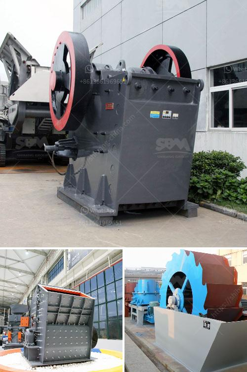

<h3>stone crushing business estimate</h3>
Stone crushing is a profitable business venture for new entrepreneurs. The demand for quality stone chips is increasing day-by-day. Stone Crusher Plant Market Opportunity

All the building constructions whether it is housing or industrial construction activities requires crushed stone. Crushed stone is also required for cement based products like RCC pipes, PSC poles, cement concrete hollow blocks, precast cement concrete slabs, well rings, window & door frames and road laying. The demand for crushed stone will continue to grow with the growth of its user industry. 

One of the most particular and general but most important materials used for making concrete is stone chips. These are used as filler with binding materials in the production of concrete. Crushed stones occupy about 72-75% of the volume of concrete and they greatly influence the strength of concrete. The good quality black stones are the most popular. However, you can set up the unit depending on the availability of raw material and major commercial center.

Stone crushing is a continuous process. The crushing and screening equipment is necessary to crush the stone into small particles. Commercial stone crusher plant is capable of processing up to 3,000 tonnes of crushed stone per day. The cost of production is a very important factor in the crushing business. A production unit can be established with an investment of Rs 5, Cr.

Major working capital costs are raw material, manpower, and utilities. Under the PP scheme, you can get the subsidy from the banks. The project is profitable. The total capital investment includes Rs 3, Cr. and working capital of Rs 2 Cr. The unit will operate in the capacity of 200 tonnes per day.

Stone crushing is the two-stage process. In the first stage, crush the 175mm stone to about 50mm. Thereafter, fit the crusher with a conversion kit to enable granulation of 5 to 20mm. Then screen the crushed material by the rotary screen. Unit location is a major factor for stone crusher plant business.

- Raw materials are regularly fed into primary crusher. They are then conveyed to the secondary crusher for further crushing.

- Finished screening is done to eliminate dust particles and washing of sand eliminates very fine particles present within. Finally, the end product will satisfy all the requirements of IS:3832020. Since the demand for quality building materials is increasing, the production is likely to increase. 

Stone crushing is a sustainable business with a steady demand for its product. The demands for the construction industry have been continuously growing, which would lead to a surge in stone crushing. The increase in infrastructure projects such as dams, roads, bridges, buildings, and industrial plants would drive the market for crushed stones significantly.

Moreover, the government's initiatives such as "Housing for All" and "Smart Cities Mission" would further fuel the demand for stone crushing. These projects would require a significant amount of construction materials, including crushed stones.

In conclusion, the stone crushing business is a profitable venture for new entrepreneurs. The demand for quality stone chips is significant, and the market is poised to grow rapidly in the coming years.
<h3>Contact us</h3><ul><li><strong>Whatsapp:&nbsp;<a href="https://wa.me/8613661969651">+8613661969651</a></strong></li><li><a href="https://swt.shibang-china.com/?git&amp;zhl&amp;stone crushing business estimate"><strong>Online Service(chat now)</strong></a></li></ul><h3>Related</h3><ul><li><a href='jaw crusher from china.md'>jaw crusher from china</a></li><li><a href='nigeria jaw crusher.md'>nigeria jaw crusher</a></li><li><a href='small scale gold mining equipment in south africa.md'>small scale gold mining equipment in south africa</a></li><li><a href='jaw crusher company.md'>jaw crusher company</a></li><li><a href='coal mill in malaysia.md'>coal mill in malaysia</a></li></ul>