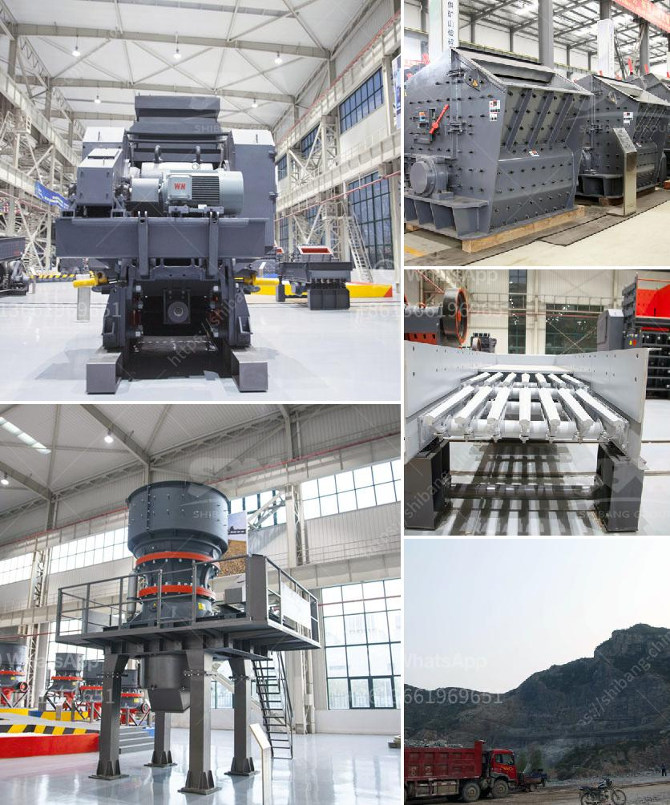

<h3>stone crushing business plan</h3>
Stone crushing business is a crucial industrial sector in UK engaged in creating crushed stone which is raw material for several construction activities like buildings, roads, bridges, drainage systems, and many others. So, stone crushing business is equally lucrative in other countries like the US, Canada, Australia, or even India. This business requires substantial capital investments, proper planning, and in-depth knowledge of the machinery involved. Therefore, a well-crafted stone crushing business plan is essential.

The first step in starting a stone crushing business is to find out the machinery required for the project. For an initial investment of about $150,000, one can purchase a sysyem of a crusher, vibratory screen, and a rotary sand washing machine. A stone crushing unit could be set up as a sole proprietorship or partnership with multiple investment options.

Market analysis becomes crucial when determining the stone crushing business's profitability. There is a high demand for crushed stone in infrastructure development projects such as railway tracks, bridges, airports, and highways. Additionally, the growing construction industry and the increasing need for residential and commercial properties also boost the demand for crushed stone.

Once the market research is complete, it is essential to create a comprehensive business plan for the stone crushing business. The plan should include the target market, marketing strategies, financial projections, and operational plans. It should also outline the sources of raw materials, the cost of setting up the business, and the expected revenue generation.

Moreover, it is crucial to comply with legal formalities such as obtaining the necessary permits and licenses required to run a stone crushing unit. Environmental concerns must also be addressed, and proper waste management and noise reduction measures should be incorporated into the business plan.

To conclude, starting a stone crushing business is a profitable venture in the construction industry. However, it requires careful planning, market analysis, and adherence to legal and environmental regulations. With the right machinery and a well-structured business plan, this venture can bring substantial returns on investment.
<h3>Contact us</h3><ul><li><strong>Whatsapp:&nbsp;<a href="https://wa.me/8613661969651">+8613661969651</a></strong></li><li><a href="https://swt.shibang-china.com/?git&amp;zhl&amp;stone crushing business plan"><strong>Online Service(chat now)</strong></a></li></ul><h3>Related</h3><ul><li><a href='price pe 600 900 stone crusher.md'>price pe 600 900 stone crusher</a></li><li><a href='sample business plan for stone crusher.md'>sample business plan for stone crusher</a></li><li><a href='how to extract gold from river sand.md'>how to extract gold from river sand</a></li><li><a href='crusher for stone stone.md'>crusher for stone stone</a></li><li><a href='machines for stone crushing from poland.md'>machines for stone crushing from poland</a></li></ul>