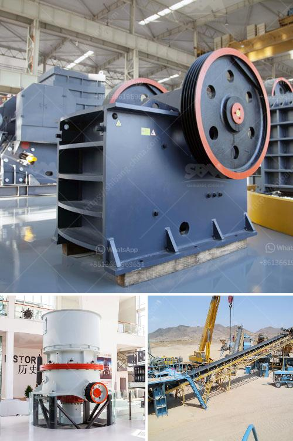

<h3>stone crushing in mineral processing</h3>
Stone crushing plays a significant role in the mining industry. In mineral processing, it is necessary to reduce the size of the ores or rocks using different types of crushers in order to produce the required size for further processing. The commonly used crushers in mineral processing include jaw crushers, gyratory crushers, cone crushers, and impact crushers.

Jaw crushers are robust machines that can handle high volumes of material and are capable of reducing the size of large rocks into smaller ones. They are commonly used in mining, metallurgical, building materials, transportation, ceramics, chemical, and other industries.

Gyratory crushers are primarily used in mining and aggregate industries. They are powerful machines that crush the materials between the concave and mantle, resulting in a finer product size. These crushers are ideal for secondary and tertiary crushing stages.

Cone crushers are designed to crush hard and abrasive materials efficiently. They are widely used in mineral processing plants, aggregate processing, and construction industries. They offer high productivity with the ability to produce a wide range of particle sizes.

Impact crushers are used to crush softer, less abrasive materials such as limestone and gypsum. These crushers offer reliable performance with high reduction ratios and improved control of particle size distribution.

Stone crushing in mineral processing is vital for the production of desired aggregate sizes, and it is an essential step in the preparation of raw materials before grinding. Breaking down the ore into finer pieces allows for better extraction of valuable minerals. While it may seem like a mundane and straightforward process, crushing rock and stone is actually a complex and sensitive process that requires specialized machinery to ensure the final product meets the required specifications.

In conclusion, stone crushing plays a vital role in mineral processing, and it is responsible for breaking down the larger rocks into smaller pieces for further processing. Different crushers are used depending on the nature of the material being crushed and the desired particle size. From jaw crushers to cone crushers and impact crushers, stone crushing machines contribute to the efficient extraction of minerals and the overall processing of the ores.
<h3>Contact us</h3><ul><li><strong>Whatsapp:&nbsp;<a href="https://wa.me/8613661969651">+8613661969651</a></strong></li><li><a href="https://swt.shibang-china.com/?git&amp;zhl&amp;stone crushing in mineral processing"><strong>Online Service(chat now)</strong></a></li></ul><h3>Related</h3><ul><li><a href='micronized quartz crusher plant.md'>micronized quartz crusher plant</a></li><li><a href='difference between underground and open cast mining.md'>difference between underground and open cast mining</a></li><li><a href='second hand stone crusher equipment medium size.md'>second hand stone crusher equipment medium size</a></li><li><a href='coal machines for sale in south africa.md'>coal machines for sale in south africa</a></li><li><a href='river stone crushing plant crusher.md'>river stone crushing plant crusher</a></li></ul>