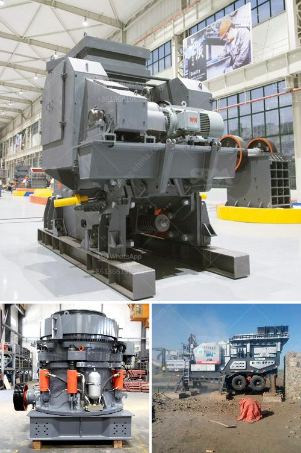

<h3>stone crushing machine factories in shanghai</h3>
Stone crushing machine factories in Shanghai are experiencing difficulties in recruiting skilled workers due to the soaring labor costs in China's manufacturing industry. 

With the ongoing industrialization and urbanization process, the demand for stone aggregates used in construction projects is increasing significantly. This has led to a surge in the establishment of stone crushing machine factories in Shanghai, where the quality of mineral resources is exceptional. 

However, the factories are struggling to meet the market demand as they face challenges in recruiting skilled workers. Shanghai, being one of the most developed cities in China, has witnessed a rapid increase in labor costs over the years. The wages demanded by skilled workers have skyrocketed, making it difficult for these factories to hire and retain talent. 

Additionally, the work in stone crushing machine factories involves repetitive tasks and long working hours, which may not be attractive to young workers seeking better career prospects. This has further intensified the labor shortage in the industry and put the factories in a difficult position.

To address this issue, factories in Shanghai are adopting various strategies. Some have increased wages and benefits to attract skilled workers, while others are focusing on automation and technological advancements to reduce the reliance on manual labor. By incorporating advanced machinery and equipment, the factories aim to improve productivity and reduce the need for a large workforce.

Moreover, these factories are collaborating with technical schools and vocational training centers to provide specialized training programs for potential workers. By offering tailored courses, they aim to equip individuals with the necessary skills and knowledge to operate and maintain stone crushing machines effectively.

Furthermore, the government can play an active role in bridging the gap between supply and demand in the labor market. It can provide incentives and support to these factories to encourage the recruitment and training of skilled workers. Additionally, investing in the development of advanced machinery and automation technology can help make the industry more attractive to the younger workforce.

In conclusion, stone crushing machine factories in Shanghai are facing challenges in recruiting skilled workers due to rising labor costs and a lack of interest in the industry among young people. The use of automation and advanced machinery, collaboration with vocational training centers, and government support are essential to overcome these difficulties and ensure the sustainability and growth of the industry.
<h3>Contact us</h3><ul><li><strong>Whatsapp:&nbsp;<a href="https://wa.me/8613661969651">+8613661969651</a></strong></li><li><a href="https://swt.shibang-china.com/?git&amp;zhl&amp;stone crushing machine factories in shanghai"><strong>Online Service(chat now)</strong></a></li></ul><h3>Related</h3><ul><li><a href='used equipment cement for sale.md'>used equipment cement for sale</a></li><li><a href='cement process plant crushing machines manufacturer.md'>cement process plant crushing machines manufacturer</a></li><li><a href='gyratory crusher hydroset.md'>gyratory crusher hydroset</a></li><li><a href='quartz ball mills hyderabad.md'>quartz ball mills hyderabad</a></li><li><a href='crusher for bed ash manufacturers.md'>crusher for bed ash manufacturers</a></li></ul>