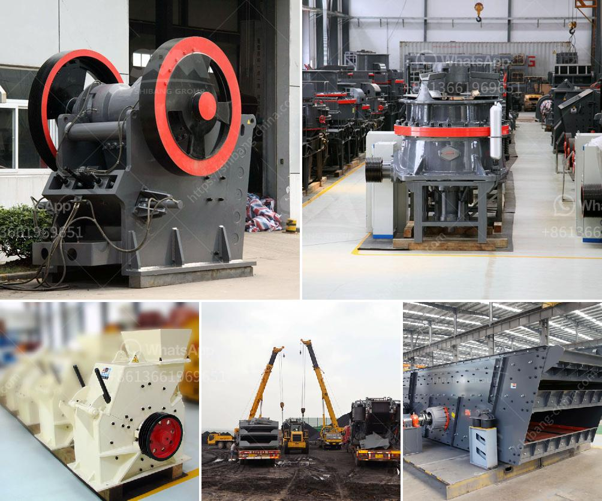

<h3>stone crushing machine factories</h3>
Stone crushing machine factories are always in a constant need to produce crushed stones for various applications. These stones are used in construction, road making, cement production, and many other industries. With the increasing demand for stones, the factories need efficient and advanced crushing machines to meet their production targets.

Stone crushing machine factories typically have a wide range of equipment such as crushers, sifters, belt conveyors, and loaders. These are used to break larger stones into smaller sizes to ensure easy transportation and proper usage in different applications. The process involves feeding stones into the machine, which then crushes them into smaller pieces.

One of the key factors in the efficiency of stone crushing machine factories is the proper maintenance and regular servicing of the equipment. By ensuring that the machines are in top condition, the factories can maximize their productivity and reduce downtime. This involves routine inspections, timely repairs, and the replacement of worn-out parts.

Furthermore, stone crushing machine factories need to have skilled and experienced staff who can operate and maintain the equipment effectively. Proper training programs should be implemented to equip the workers with the necessary skills and knowledge to handle the machines safely.

Moreover, stone crushing machine factories need to comply with environmental regulations and adopt sustainable practices. These factories should have dust suppression systems in place to minimize air pollution and regularly clean their surroundings to prevent contamination.

In conclusion, stone crushing machine factories play a crucial role in producing crushed stones for various industries. To ensure maximum efficiency and productivity, these factories should focus on proper maintenance of their equipment, provide training to their staff, and comply with environmental regulations. By doing so, they can meet the increasing demand for crushed stones and contribute to the growth of various sectors.
<h3>Contact us</h3><ul><li><strong>Whatsapp:&nbsp;<a href="https://wa.me/8613661969651">+8613661969651</a></strong></li><li><a href="https://swt.shibang-china.com/?git&amp;zhl&amp;stone crushing machine factories"><strong>Online Service(chat now)</strong></a></li></ul><h3>Related</h3><ul><li><a href='quarry machine and crusher plant sale in australia.md'>quarry machine and crusher plant sale in australia</a></li><li><a href='gypsum production equipments in philippines.md'>gypsum production equipments in philippines</a></li><li><a href='crushers for sale.md'>crushers for sale</a></li><li><a href='ball mill using industry.md'>ball mill using industry</a></li><li><a href='crushing and screening plants.md'>crushing and screening plants</a></li></ul>