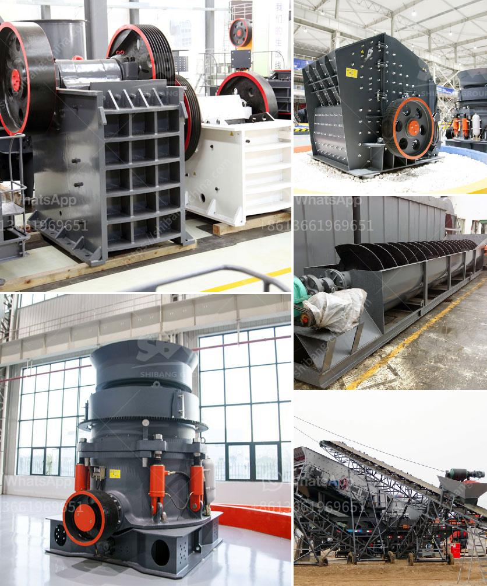

<h3>stone crushing machine in zambia</h3>
Stone crushing machine is widely used in the mining industry, bridge and high-rise construction sectors. Zambia is a vast landlocked country in southern Africa with a population nearing 18 million people. It has a diverse and rich culture spanning over 70 ethnic groups. Zambia's economy is heavily reliant on copper mining, and the mining industry employs a large number of citizens.

In recent years, with rapid economic development, the demand for construction materials has increased significantly. As a result, stone crushing machines have also become more popular in Zambia. The increasing demand for stone aggregate has driven the development of stone crushing machines, which has broadened the market scope and potential of the stone crushing industry in Zambia.

The stone crushing machine is commonly used for crushing various hard and medium-hard stones, rocks, granite, limestone, basalt, and other stones. It can be used for primary, secondary, and fine crushing in different stages. The stone crushing machine in Zambia is widely used in the mining industry, construction industry, road building materials industry, chemical industry, and other industries.

There are two main types of stone crusher machines in Zambia: stone crusher machine and mobile stone crusher machine. The stone crusher machine can be used to process hard stones, medium-sized stones, and small stones. These hard stones include granite, limestone, basalt, and other materials. The mobile stone crusher machine can also be used to process different stones, and it can work independently or together with other devices according to the materials needing to be crushed.

The stone crushing machine in Zambia is widely used for crushing various hard and medium-hard stones, rocks, granite, limestone, basalt, and other stones. It can be used for primary, secondary, and fine crushing in different stages. The stone crushing machine in Zambia has a large crushing ratio, a high output capacity, and an even particle size.

The stone crushing machine in Zambia is widely used for crushing hard and medium-hard stones, granite, limestone, basalt, shale, river pebble, bluestone, sandstone, calcium carbide, iron ore, copper ore, and other materials. It can be used for primary, secondary, and fine crushing in different stages. The stone crushing machine in Zambia has a high degree of automation, low operating costs, high crushing efficiency, and high energy saving.

In conclusion, the stone crushing machine in Zambia has been rapidly developed, and widely used in the mining industry, bridge and high-rise construction sectors. The stone crushing machine in Zambia is suitable for crushing various hard and medium-hard stones, rocks, granite, limestone, basalt, shale, river pebble, bluestone, sandstone, calcium carbide, iron ore, copper ore, etc. It can be used for primary, secondary, and fine crushing in different stages. The stone crushing machine in Zambia not only can improve the overall output and efficiency but also save energy and reduce operational costs for the mining industry.
<h3>Contact us</h3><ul><li><strong>Whatsapp:&nbsp;<a href="https://wa.me/8613661969651">+8613661969651</a></strong></li><li><a href="https://swt.shibang-china.com/?git&amp;zhl&amp;stone crushing machine in zambia"><strong>Online Service(chat now)</strong></a></li></ul><h3>Related</h3><ul><li><a href='malaysia stone crushing machine crusher for sale.md'>malaysia stone crushing machine crusher for sale</a></li><li><a href='gypsum production equipments in philippines.md'>gypsum production equipments in philippines</a></li><li><a href='used crusher plants canada.md'>used crusher plants canada</a></li><li><a href='used sand wash equipment.md'>used sand wash equipment</a></li><li><a href='industrial mineral silica sand.md'>industrial mineral silica sand</a></li></ul>