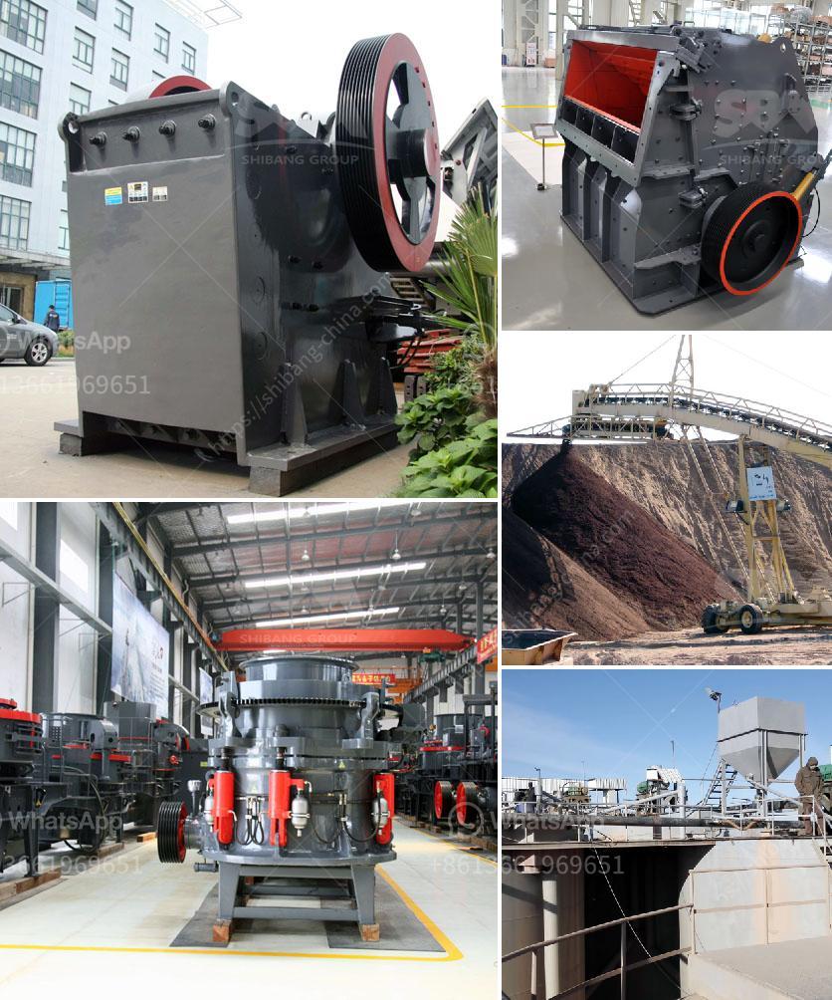

<h3>stone crushing machines</h3>
Stone crushing machines are used in a number of areas, such as construction materials, mining, metallurgy, forests, research and railroads, and so on. These machines are used to break into harmless stones so that they can be used and sold in a wide range of applications.

One of the most common uses of stone crushing machines is in the mining industry. Many industries use this process to crush large rocks into smaller, more manageable pieces. Crushers reduce the size of the stone by repeatedly pounding it with heavy hammers. These machines can crush rocks of various hardness levels, ranging from soft limestone to hard granite.

Another important area where stone crushing machines are used is in the construction industry. Construction projects often require crushed stones of different sizes, which can be used as aggregate material in concrete mixtures. These machines can break down large rocks into smaller, more uniform sizes that meet industry standards.

Furthermore, stone crushing machines are also employed in the metallurgy industry. Crushing machines are used to reduce the size of raw materials for further processing. This allows for easier extraction of valuable metals from the rock. Stone crushing machines are vital pieces of equipment in scrap metal recycling plants and other metal recovery facilities.

In addition to their uses in mining, construction, and metallurgy, stone crushing machines are also widely used in forestry applications. Many forestry companies use these machines to reduce the size of trees and generate wood chips for various purposes. By crushing trees, the machines can generate reusable materials that can be used for fuel, landscaping, or composting.

Railroads are another area where stone crushing machines find extensive use. These machines are used to break down rocks to create ballast, which is used to stabilize railway tracks. The crushed rocks form a firm foundation that holds the tracks in place, ensuring smooth and safe train operations.

In conclusion, stone crushing machines play a crucial role in various industries. They are used to break down rocks into smaller, more manageable pieces for a variety of applications such as construction materials, mining, metallurgy, forestry, and railroads. These machines enable the extraction and processing of valuable raw materials, contribute to sustainable practices in the recycling industry, and ensure safe and efficient railway operations.
<h3>Contact us</h3><ul><li><strong>Whatsapp:&nbsp;<a href="https://wa.me/8613661969651">+8613661969651</a></strong></li><li><a href="https://swt.shibang-china.com/?git&amp;zhl&amp;stone crushing machines"><strong>Online Service(chat now)</strong></a></li></ul><h3>Related</h3><ul><li><a href='ball mill with high quality and best price.md'>ball mill with high quality and best price</a></li><li><a href='sand core machine manufacturers.md'>sand core machine manufacturers</a></li><li><a href='picture of a rock crusher machine.md'>picture of a rock crusher machine</a></li><li><a href='talcum powder grinding machine in kerala.md'>talcum powder grinding machine in kerala</a></li><li><a href='calcium carbonate production plant.md'>calcium carbonate production plant</a></li></ul>