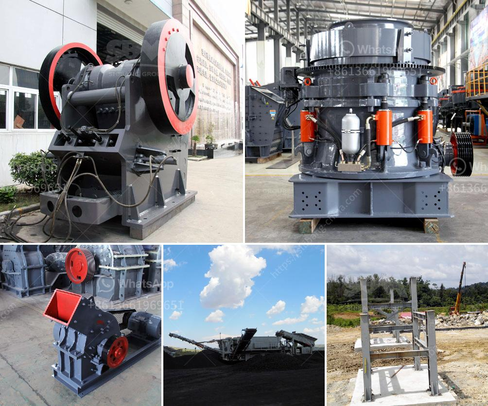

<h3>stone crushing plant leaves in uganda</h3>
Stone crushing plant leaves in Uganda have attracted a lot of attention in recent years. This phenomenon is due to the fact that many people in Uganda rely on the abundance of nature for their daily livelihoods such as farming. As a result, the destruction of nature and the destruction of stone crushing plants have become a significant concern to the people of Uganda.

One of the most notable environmental concerns associated with stone crushing plants is the extensive damage done to the environment during the process of crushing stones. Many workers in these plants face serious health issues due to exposure to dust and other harmful particles. The dust generated during the crushing process can cause respiratory problems, eye irritation, skin rashes, and other health issues. Furthermore, the noise pollution caused by the operation of these plants can also have long-term effects on the health and well-being of the workers and nearby communities.

In addition to health concerns, stone crushing plants also contribute to the degradation of the environment. The clearing of trees and vegetation to make way for these plants leads to deforestation and loss of biodiversity. This not only affects the balance of the ecosystem but also disrupts the habitats of many plant and animal species. The rapid depletion of vegetation also leads to soil erosion and reduces the fertility of the land, making it harder for farmers to grow crops and sustain their livelihoods.

The impact of stone crushing plants on the environment is not limited to land degradation. These plants also contribute to water pollution as they require large amounts of water for their operation. The contaminated water, along with the chemical runoff from the plants, often finds its way into rivers, lakes, and other water bodies, affecting aquatic life and making the water unfit for consumption by both humans and animals.

To combat these environmental issues, it is essential to promote sustainable and responsible practices in the stone crushing industry. This can be achieved through the implementation of strict regulations and guidelines by the government. It is crucial for the government to enforce regulations that ensure the adherence to safety standards, such as the provision of protective gear for workers and regular monitoring of air and water quality.

Additionally, promoting alternative and more sustainable methods of construction and infrastructure development can reduce the demand for stone crushing plants. The use of eco-friendly materials such as recycled concrete can significantly reduce the need for quarrying and stone crushing, thus minimizing the environmental impact associated with these plants.

Furthermore, community education and awareness programs can play a crucial role in mitigating the negative impacts of stone crushing plants. By educating communities about the importance of biodiversity, sustainable development, and the harmful effects of stone crushing plants, individuals can make informed choices and take necessary actions to protect and preserve their environment.

In conclusion, the presence of stone crushing plants in Uganda raises significant environmental concerns. The destruction of nature, health hazards to workers, water pollution, and other detrimental effects highlight the urgent need for sustainable practices and strict regulations. By adopting eco-friendly alternatives and educating communities, we can work towards a future where both economic development and environmental conservation can coexist.
<h3>Contact us</h3><ul><li><strong>Whatsapp:&nbsp;<a href="https://wa.me/8613661969651">+8613661969651</a></strong></li><li><a href="https://swt.shibang-china.com/?git&amp;zhl&amp;stone crushing plant leaves in uganda"><strong>Online Service(chat now)</strong></a></li></ul><h3>Related</h3><ul><li><a href='lm vertical grinding mill.md'>lm vertical grinding mill</a></li><li><a href='industrial fine powder grinding machinery.md'>industrial fine powder grinding machinery</a></li><li><a href='suppliers of jaw crushers in south africa.md'>suppliers of jaw crushers in south africa</a></li><li><a href='kaolin mill machine 400 mesh.md'>kaolin mill machine 400 mesh</a></li><li><a href='buy stone quarry crusher equipment from europe.md'>buy stone quarry crusher equipment from europe</a></li></ul>