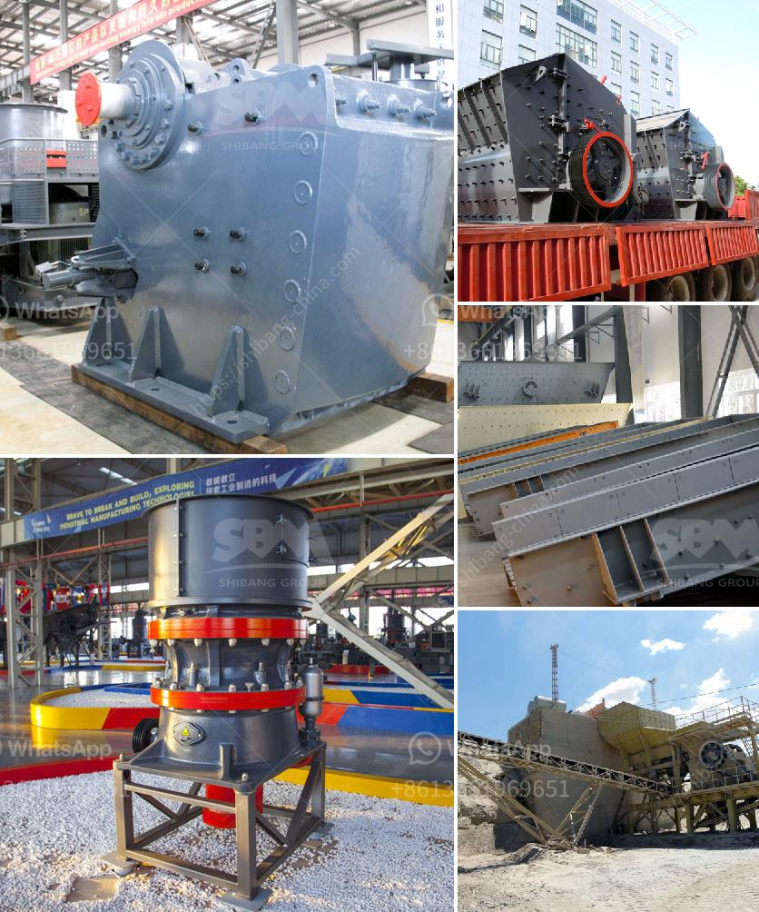

<h3>stone crushing process costs</h3>
Stone crushing process costs are the primary consideration for most quarry owners. Whether it is renting or owning the property and maintaining the equipment, the costs quickly add up. Stone crushers generate huge noise during crushing stones. The hazardous emissions generated by the stone crusher industry pose a serious health threat to the workers and the nearby residents. The costs associated with these risks cannot be ignored.

One of the primary costs to consider in stone crushing process is maintaining the machinery. Stone crushers are heavy-duty machines that require regular maintenance to ensure their proper functioning. Regular maintenance helps prolong the life of the machinery and reduces the likelihood of breakdowns and expensive repairs. This includes lubrication, cleaning, and inspection of various parts such as the bearings, drive belts, and hydraulic systems. Hiring skilled technicians for regular maintenance incurs additional costs.

Another significant cost consideration is the wear and tear of the machine parts. Stone crushers involve the constant crushing of stones, which leads to the fast wearing of the components like the hammers, jaws, and liners. These parts need to be replaced frequently, which adds to the overall cost of the crushing process. Using high-quality and durable parts may help reduce the frequency of replacements, but they come at an increased cost.

Transportation is another major cost in the stone crushing process. Quarries are often located far away from the construction sites where the crushed stones are required. Transporting the stones over long distances can significantly increase the overall cost, especially if multiple trips are required. Fuel expenses and vehicle maintenance can take a toll on the budget. Optimal transportation planning and using efficient vehicles can help reduce these costs.

Environmental regulations and mitigation measures are necessary during the stone crushing process. Quarry owners need to comply with various environmental regulations, including dust control, noise reduction, and water conservation. Implementing these measures requires investing in specialized equipment and technologies, as well as ensuring proper training and monitoring. These additional costs should not be ignored when calculating the overall stone crushing process costs.

Health and safety measures are also vital considerations. Stone crushing involves heavy machinery and potential risks for the workers. Employers must invest in personal protective equipment (PPE), safety training, and regular safety inspections to minimize accidents and injuries. Failing to meet safety standards can lead to legal and financial consequences, which can significantly impact the overall costs.

In conclusion, stone crushing process costs encompass a wide range of factors. From machinery maintenance and wear and tear to transportation and environmental regulations, every aspect needs to be considered. Quarry owners must carefully assess these costs and strategize their operations accordingly. Prioritizing safety, minimizing environmental impacts, and ensuring efficient utilization of resources can help manage the costs and achieve a profitable stone crushing process.
<h3>Contact us</h3><ul><li><strong>Whatsapp:&nbsp;<a href="https://wa.me/8613661969651">+8613661969651</a></strong></li><li><a href="https://swt.shibang-china.com/?git&amp;zhl&amp;stone crushing process costs"><strong>Online Service(chat now)</strong></a></li></ul><h3>Related</h3><ul><li><a href='quartz plant on sale.md'>quartz plant on sale</a></li><li><a href='grinding machine for salt in pakistan.md'>grinding machine for salt in pakistan</a></li><li><a href='impact crusher machine.md'>impact crusher machine</a></li><li><a href='sand manufacturing plant.md'>sand manufacturing plant</a></li><li><a href='belt price conveyor belt price malaysia.md'>belt price conveyor belt price malaysia</a></li></ul>