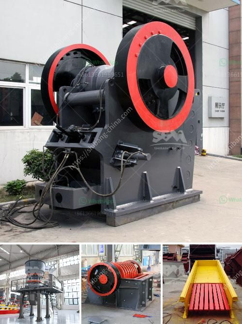

<h3>stone crushing sample business plan</h3>
First of all, break the big stone boulders to smaller size manually. Then it is fed to the stone crusher. The crusher can accept the stone size of 175mm. Stone crushing is the two-stage process. In the first stage, crush the 175mm stone to about 50mm. Thereafter, fit the crusher with a conversion kit to enable granulation of 5 to 20mm. Then screen the crushed material by the rotary screen. Unit location is a major factor for stone crusher plant business.

It is advantageous if the crushed stone unit is set up near the quarries where the granite boulders of various sizes are available for the crushing unit. Jaw crusher is the main machine used in stone crushing plant with the maximum capacity of processing up to 1,200 TPH. The jaw crusher can also process the hardest rocks and ores with a compressive strength of over 320Mpa.

The machine is generally used for primary crushing, and the raw materials are large-sized stone. However, different types of jaw crushers require different input sizes and have different crushing capacities. The investment in a stone crushing plant is usually between 10-15% for customized services.

The raw materials are uniformly transported to the jaw crusher or impact crusher by the vibrating feeder for coarse crushing. After being crushed and sieved, the qualified finished products are transported to the finished product area through the belt conveyor, and the sorted materials are transported to the finished product area. The unqualified materials are sent back to the crushing equipment through the belt conveyor for re-crushing, forming a closed circuit and multiple cycles. The particle size of the finished product can be combined and graded according to the user's needs.

When choosing crushing equipment, customers should choose suitable crushing equipment according to different requirements of materials and finished products. If hydraulic cone crusher is the best choice for crushing high hardness materials, while impact crusher is a more suitable machine for crushing medium hardness materials. It also works well with the two together. Stone crushing process is generally divided into two stages: primary crushing and secondary crushing.

In the primary crushing process, raw materials are evenly and gradually conveyed to the jaw crusher for a primary crushing. The crushed stone materials are conveyed to crushing plant by belt conveyor for secondary crushing before they are sent to vibrating screen to be separated.

After separating, qualified materials will be taken away as final products, while unqualified materials will be carried back to the stone crushing equipment for recrushing. And customers can classify final products according to different size ranges. All the final products are up to the related standards within and beyond China. Of course, according to different requirements, customers can adjust the size of their final products from this stone crushing plant.

Clients will get the satisfactory products after objects being crushed for several times. Dust is generated during the working process while the dust control units are needed.

Jaw Crusher : A jaw crusher is the compression kind of crusher and used for crushing rock between two heavy steel jaws. The movable jaw compresses the material against the fixed jaw and crushes material at the desired size. Material exits from the bottom of jaws.

Cone Crusher : Cone Crusher also called a gyratory crusher. Cone crusher also a compression kind of machine that reduces, squeezing, or compressing the material between a moving piece of steel and a stationary piece of steel. The material passed it through the bottom of the machine after passed the cavity.

Roll Crusher : The roller crushers operate on the same principle as the jaw crushers. The rollers are set up vertically with horizontal counter rotating shafts, which act like a series of giant gears to produce a very fine product. The ground particles are also downgraded to control the grinding process. For crushing, you can have a choice according to your needs from the small jaw crusher or the large jaw crusher.

Mobile Crushing Plant : Mobile crusher can be driven to crushing site to crush stone, ore, construction waste, etc., and it can be quickly put into production. Beneficiation Plant. Mineral processing equipment is for beneficiation of various metal ore and non-metallic ore, such as iron ore, copper ore, etc. Dryer Machine. Industrial dryer is a type of drying machine which is mainly used for drying the materials with a certain humidity and granularity in ore beneficiation .......

Overall, stone crushing plants should establish cooperation with local communities to protect the environment and promote a green economy. One of the most basic requirements for producing high-quality aggregate is the prevention of dust pollution during the production process. Dust control measures are not only important for the health of workers, but also crucial for ensuring product quality and reducing production costs. Therefore, stone crushing plants should take environmental protection measures to reduce their impact on the surrounding environment and ensure the sustainable development of the stone crushing industry.
<h3>Contact us</h3><ul><li><strong>Whatsapp:&nbsp;<a href="https://wa.me/8613661969651">+8613661969651</a></strong></li><li><a href="https://swt.shibang-china.com/?git&amp;zhl&amp;stone crushing sample business plan"><strong>Online Service(chat now)</strong></a></li></ul><h3>Related</h3><ul><li><a href='limestone crusher china.md'>limestone crusher china</a></li><li><a href='africa sand washing plant for rent and sale.md'>africa sand washing plant for rent and sale</a></li><li><a href='sale limestone crusher malaysia.md'>sale limestone crusher malaysia</a></li><li><a href='ballast crusher for sale in kenya.md'>ballast crusher for sale in kenya</a></li><li><a href='silica sand washing plant china.md'>silica sand washing plant china</a></li></ul>