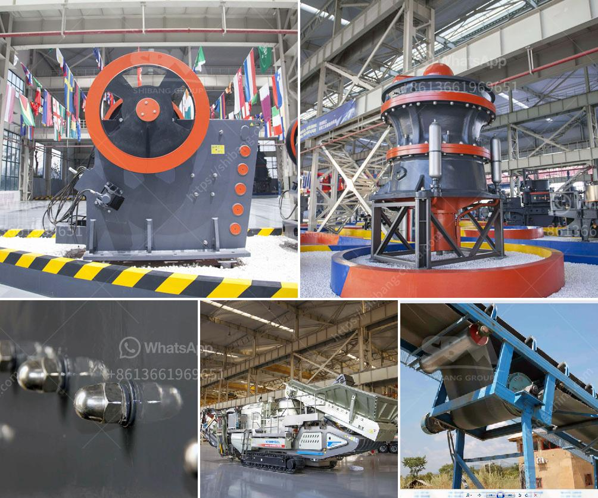

<h3>stone grinder machines for sale usa</h3>
In today's fast-paced world, efficiency and convenience hold utmost importance in various industries. One such invaluable machinery is the stone grinder machine, which revolutionizes the way materials are processed. As these machines offer a wide array of benefits, let's delve deeper into their functionalities, incredible applications, and availability in the USA market.

Stone grinder machines are designed to grind and shape a variety of solid materials effortlessly. They are powered by powerful motors, and their high-speed grinding action allows for quick and precise material shaping. These machines can efficiently tackle even the toughest materials such as granite, marble, concrete, and natural stone, making them an essential tool in a range of industries from construction to stone fabrication and beyond.

1. Construction Industry: Stone grinder machines are utilized extensively in the construction industry for surface preparation, grinding, and polishing concrete floors. They are highly efficient in removing paint, adhesives, overlays, and curing compounds from the concrete surface. Moreover, they help in achieving a smooth and polished finish, enhancing the aesthetic appeal of the construction project.

2. Stone Fabrication: These machines are widely used in the stone fabrication industry, enabling craftsmen to shape and polish stones with precision. From countertops to statues and sculptures, stone grinder machines ensure a flawless finish, improving the visual appeal and value of the final product.

3. Metalworking Industry: Stone grinder machines are also used by metalworkers to sharpen tools and blades. The abrasive nature of the grinding wheels ensures a precise and efficient sharpening process, optimizing performance and extending the lifespan of various metal tools.

Stone grinder machines for sale are easily accessible in the USA market. A variety of reputable manufacturers and suppliers offer a wide range of models with varying features and capabilities. Due to the high demand in different industries, these machines are available in different sizes, power options, and quality levels to cater to diverse customer requirements.

When purchasing a stone grinder machine, it is essential to consider several factors such as the motor power, wheel size, grinding depth, and additional features like dust extraction systems or adjustable handles for ease of use. Furthermore, it is recommended to buy from established and reputable suppliers who provide after-sales support, spare parts, and warranties to ensure a seamless experience.

The stone grinder machines have undoubtedly transformed various industries by facilitating efficient material processing, shaping, and polishing. With their versatile applications and widespread availability in the USA market, these machines emerge as an indispensable asset to enhance productivity and achieve superior finishes. Whether you are involved in construction, stone fabrication, or metalworking, investing in a reliable stone grinder machine will undoubtedly yield long-term benefits, ensuring precision, durability, and cost-effectiveness.
<h3>Contact us</h3><ul><li><strong>Whatsapp:&nbsp;<a href="https://wa.me/8613661969651">+8613661969651</a></strong></li><li><a href="https://swt.shibang-china.com/?git&amp;zhl&amp;stone grinder machines for sale usa"><strong>Online Service(chat now)</strong></a></li></ul><h3>Related</h3><ul><li><a href='petroleum coke process.md'>petroleum coke process</a></li><li><a href='aggregate crushing cost analysis in india.md'>aggregate crushing cost analysis in india</a></li><li><a href='price on a jaw crusher in south africa.md'>price on a jaw crusher in south africa</a></li><li><a href='dolomite crusher manufacturer in usa.md'>dolomite crusher manufacturer in usa</a></li><li><a href='talc powder plant.md'>talc powder plant</a></li></ul>