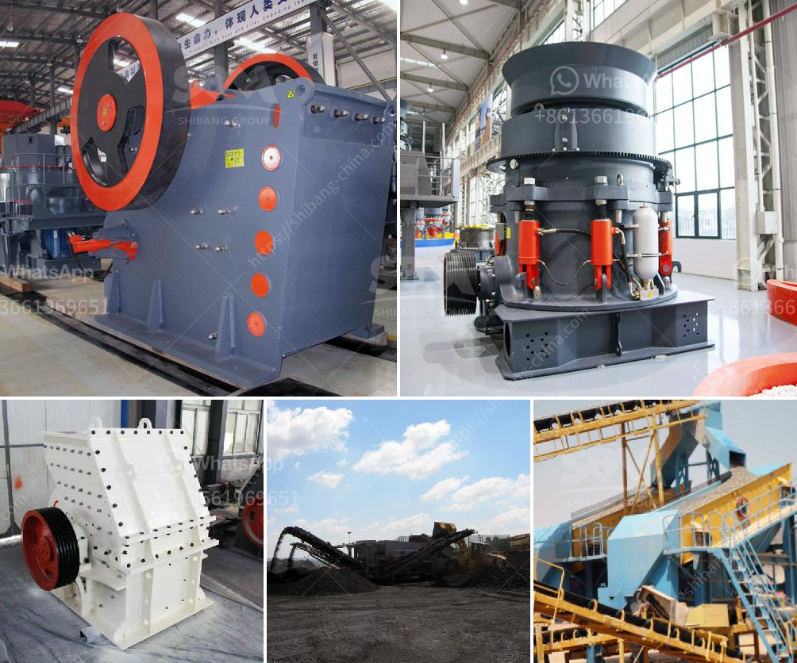

<h3>stone jaw crusher ppt for seminar</h3>
A stone jaw crusher is a powerful tool for crushing stones and rocks into smaller pieces or gravel. It is used in a variety of industries, such as mining, construction, and demolition.

Jaw crushers have a high crushing ratio and deliver a consistent performance. They are built to break down the hardest materials, such as granite, basalt, and limestone, and are widely used in the mining and construction industries. The crushing process is achieved by the eccentric movement of the jaws, which pushes the material against a fixed plate.

One of the significant advantages of a stone jaw crusher is its versatility. It can be used for a wide range of applications, from primary crushing to secondary crushing and even tertiary crushing. The size of the crushed material can also be adjusted by changing the gap between the jaws, allowing for more control over the final product.

During operation, the stone jaw crusher produces a lot of dust, which can be controlled with proper ventilation and water suppression systems. This ensures that the environment remains clean and safe for the workers. Additionally, modern jaw crushers are designed with noise reduction features, minimizing the noise pollution caused by the crushing process.

Another important feature of a stone jaw crusher is its durability. It is built to withstand heavy use and can handle even the toughest materials. The structure of the jaw crusher is made of high-quality steel, ensuring a long lifespan and reliable performance. Regular maintenance and inspections are necessary to keep the crusher in optimal condition and prevent any unexpected breakdowns.

In summary, a stone jaw crusher is a versatile and reliable equipment that is indispensable for various industries. Its high crushing ratio, durability, and ease of maintenance make it an ideal choice for crushing hard and tough materials. Additionally, with proper dust and noise control measures, it can provide a safe and comfortable working environment.

If you are considering investing in a stone jaw crusher, it is essential to choose a reputable manufacturer and supplier. Look for companies with a proven track record, excellent customer reviews, and a wide range of models to choose from. Additionally, ensure that the crusher meets your specific requirements and is backed by a comprehensive warranty and after-sales service.

By opting for a stone jaw crusher, you can streamline your operations and increase productivity. Crushing rocks and stones efficiently will save you time, labor, and money. Whether you are involved in mining, construction, or any other industry that requires crushing, a stone jaw crusher is a valuable tool that should not be overlooked.
<h3>Contact us</h3><ul><li><strong>Whatsapp:&nbsp;<a href="https://wa.me/8613661969651">+8613661969651</a></strong></li><li><a href="https://swt.shibang-china.com/?git&amp;zhl&amp;stone jaw crusher ppt for seminar"><strong>Online Service(chat now)</strong></a></li></ul><h3>Related</h3><ul><li><a href='bal mill snsttlled capacity.md'>bal mill snsttlled capacity</a></li><li><a href='hammers mill machine.md'>hammers mill machine</a></li><li><a href='mobile crushing plant manufacturers.md'>mobile crushing plant manufacturers</a></li><li><a href='vibrating screen consumption.md'>vibrating screen consumption</a></li><li><a href='usd jaw crusher in turkey.md'>usd jaw crusher in turkey</a></li></ul>