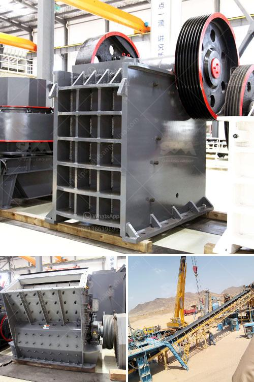

<h3>stone mining and quarrying business plan</h3>
Thinking about starting a stone mining and quarrying business? This article provides a detailed business plan outline that will guide you in starting and growing your operation efficiently. We will cover the essential aspects of the industry, including market analysis, operations plan, marketing strategy, financial projections, and more. By the end, you'll have a solid blueprint to launch your business successfully.

Before diving into your business venture, it's crucial to conduct a thorough market analysis. Study the stone mining and quarrying industry to identify key trends, potential customers, and competitors. Understand the demand and supply dynamics, including the level of competition in your target region. Explore the regulations, permitting requirements, and local laws regarding land and resource extraction.

Your operations plan outlines the day-to-day activities required to run your stone mining and quarrying business effectively. Determine the location of your quarry and assess the available resources. Evaluate the geological and topographical conditions to ensure the viability of your operation.

Next, estimate the amount and quality of stone you can extract within specific timeframes. This information will help determine your production capacity and set realistic goals for your business. Plan the equipment needed for extraction, including machinery, tools, and vehicles. Consider leasing or purchasing options based on your budget and long-term goals.

Ensure the safety of your workers by implementing proper training programs and adhering to occupational health and safety guidelines. Develop an efficient production process, taking into account factors like stone extraction, processing, storage, and transportation.

Creating a solid marketing strategy is essential to attract customers and establish your presence in the stone mining and quarrying industry. Identify your target market and segments, such as construction companies, landscaping businesses, and infrastructure developers. Develop a comprehensive marketing plan that includes online and offline strategies, such as website development, search engine optimization, and social media marketing.

Join industry associations and attend trade shows to network with potential customers, suppliers, and partners. Establish strong relationships with local contractors and government agencies responsible for large-scale infrastructure projects. Focus on providing exceptional customer service and quality stone products to build a reputation for reliability and trustworthiness.

Developing a reliable financial plan is paramount to secure funding and manage your stone mining and quarrying business effectively. Start by estimating your startup costs, including equipment purchases, lease agreements, permits, and marketing expenses. Create detailed financial projections for at least three years, considering factors such as revenue, expenses, and profit margin.

Identify potential sources of funding, including loans, grants, and investment opportunities. Establish relationships with financial institutions and venture capitalists who specialize in supporting mining and quarrying businesses.

Monitor your financial performance regularly and adjust your operations accordingly. Carefully manage your cash flow to ensure you have sufficient working capital to cover expenses during seasonal market fluctuations.

Starting a stone mining and quarrying business requires careful planning and strategic thinking. By conducting a thorough market analysis, developing an efficient operations plan, implementing a comprehensive marketing strategy, and creating reliable financial projections, you can lay the foundation for a successful venture. Remember, staying informed about market trends and adapting to changes is crucial for sustaining and growing your business in the long run.
<h3>Contact us</h3><ul><li><strong>Whatsapp:&nbsp;<a href="https://wa.me/8613661969651">+8613661969651</a></strong></li><li><a href="https://swt.shibang-china.com/?git&amp;zhl&amp;stone mining and quarrying business plan"><strong>Online Service(chat now)</strong></a></li></ul><h3>Related</h3><ul><li><a href='old jaw crusher for sale in kenya.md'>old jaw crusher for sale in kenya</a></li><li><a href='dolomite crushing production line equipment.md'>dolomite crushing production line equipment</a></li><li><a href='design of a barite grinding mill.md'>design of a barite grinding mill</a></li><li><a href='magnesium carbonate plant layout.md'>magnesium carbonate plant layout</a></li><li><a href='gypsum crusher price in ethiopia.md'>gypsum crusher price in ethiopia</a></li></ul>