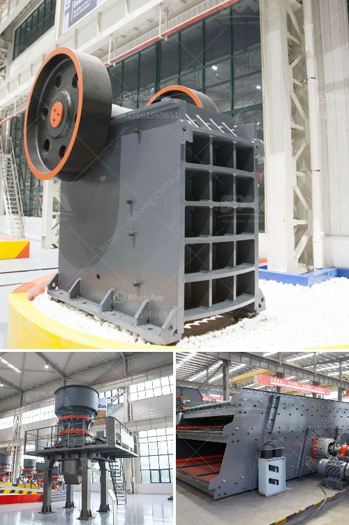

<h3>stone mining crusher in jharkhand</h3>
Stone mining crusher is highly restrictive in Jharkhand due to various regulatory guidelines imposed by the state and central governments. The mining process and the machinery required for it to function are intricate, making the availability of skilled labor and specialized equipment a challenge. However, Jharkhand boasts of abundant mineral resources, particularly the stone mines, making it integral to the construction and infrastructure industry.

Jharkhand is known for its rich reserves of minerals like coal, iron ore, and copper ore. However, stone mining is also prevalent in the state. The stone mining industry is an important part of Jharkhand's economy and contributes significantly to the overall growth and development of the state.

Stone mining in Jharkhand is mainly concentrated in the districts of Dumka, Deogarh, Pakur, Jamtara, Giridih, and Bokaro. These areas have a wide variety of stone mines of different specifications, sizes, and qualities. The stone mines produce raw material for various construction activities such as building roads, bridges, houses, and commercial establishments.

The stone mining crusher mainly includes jaw crusher, cone crusher, impact crusher, mobile crusher and crusher plants. These mining crushers are highly demanded in stone mining industry due to their features such as sturdy construction, high crushing capacity, chemical resistance, and user-friendly operations. These crushers help users process various raw materials, ranging from soft limestone to harder basalt.

In Jharkhand, cities like Ranchi, Jamshedpur, Dhanbad, Bokaro, and Hazaribagh have a wide range of stone crushers. Those involved in stone mining, crushers, and related activities like transportation, screening, and washing also need electricity supply. They require support from the power department to carry out their mining operations effectively.

However, stone mining crushers are plagued by a number of environmental and health related issues. The lack of proper facilities, inadequate safety measures, and irresponsible mining practices can have detrimental effects on the environment and human health. The emissions from stone mining and crushing units are contributing to air and water pollution in the region.

To address these issues, the Jharkhand government and the mining department have taken several initiatives. They have imposed stringent regulations and guidelines on stone mining operations to minimize the negative impacts on the environment. These guidelines include proper waste management, dust control measures, and regular monitoring of air and water quality near the mining sites.

Additionally, the government is promoting sustainable mining practices through awareness campaigns, skill development programs, and financial incentives for adopting advanced technologies. The aim is to ensure responsible mining practices that minimize environmental degradation and promote the overall well-being of the community.

In conclusion, stone mining crusher is an important part of the construction and infrastructure industry in Jharkhand. The state possesses huge reserves of various grades of granite, marble, stone, and basalt, making it ideal for commercial and industrial purposes. The stone mines, which are spread across the state, contribute significantly to the economy of Jharkhand. However, stringent regulations and guidelines are essential to minimize the negative impact of stone mining on the environment and human health. The government's initiatives focusing on sustainable mining practices and responsible waste management are key to ensuring long-term viability and growth of the stone mining crusher industry in Jharkhand.
<h3>Contact us</h3><ul><li><strong>Whatsapp:&nbsp;<a href="https://wa.me/8613661969651">+8613661969651</a></strong></li><li><a href="https://swt.shibang-china.com/?git&amp;zhl&amp;stone mining crusher in jharkhand"><strong>Online Service(chat now)</strong></a></li></ul><h3>Related</h3><ul><li><a href='malaysia gravel crusher machine.md'>malaysia gravel crusher machine</a></li><li><a href='project report on m sand.md'>project report on m sand</a></li><li><a href='companies that sell industrial ball mills in malaysia.md'>companies that sell industrial ball mills in malaysia</a></li><li><a href='mobile crushing plant manufacturers.md'>mobile crushing plant manufacturers</a></li><li><a href='turkey project gypsum powder production line.md'>turkey project gypsum powder production line</a></li></ul>