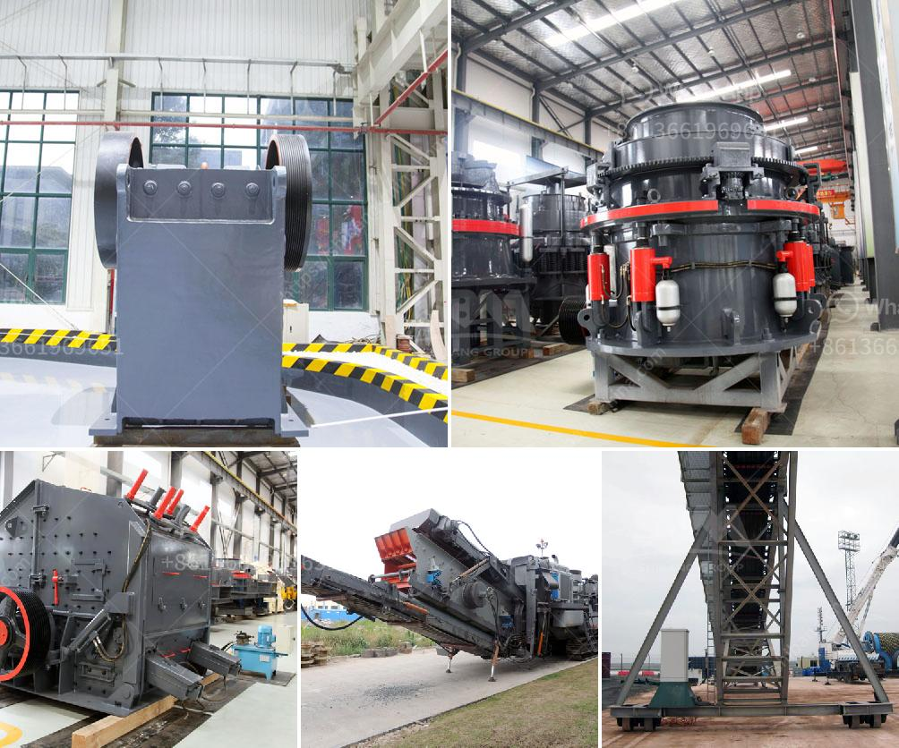

<h3>stone quarry equipment</h3>
Stone quarry equipment is a crucial aspect of the mining industry. As the name suggests, a quarry is a place where different types of stones are extracted. In this process, heavy equipment such as excavators, bulldozers, and cranes are utilized to extract these precious stones from deep within the earth. There are various types of equipment involved in this process, ensuring a smooth and efficient operation.

One of the most important pieces of equipment used in stone quarrying is a crusher. A crusher is a machine that uses mechanical energy to break down big rocks into small manageable sizes. This machine is essential in processing stones into usable materials, ensuring they can be used in construction projects or other applications.

Other key equipment includes drills and blasting tools. These machines are used to create blast holes in the rocks, making it easier for the excavators and bulldozers to remove the stones. Drills and blasting tools play a significant role in the quarrying process as they speed up the extraction and reduce manual efforts.

Excavators and bulldozers are also vital in stone quarrying as they help remove the stones from the ground. Excavators are used to dig deep into the earth and extract large rocks, while bulldozers are used to push and transport these rocks to designated areas for further processing.

Another piece of equipment commonly used in stone quarrying is a vibrating screen. This machine is responsible for separating crushed rocks into different sizes, ensuring that the stones meet the required specifications. These screens are essential in the stone quarrying process as they help manage the quality and consistency of the output.

In conclusion, stone quarry equipment is vital in the mining industry. Without these machines, the extraction and processing of stones would be significantly more challenging and time-consuming. From crushers to bulldozers, each piece of equipment plays a crucial role in ensuring a smooth and efficient stone quarrying process.
<h3>Contact us</h3><ul><li><strong>Whatsapp:&nbsp;<a href="https://wa.me/8613661969651">+8613661969651</a></strong></li><li><a href="https://swt.shibang-china.com/?git&amp;zhl&amp;stone quarry equipment"><strong>Online Service(chat now)</strong></a></li></ul><h3>Related</h3><ul><li><a href='cpc 75 tph stone crusher price in ranchi.md'>cpc 75 tph stone crusher price in ranchi</a></li><li><a href='aggregate production.md'>aggregate production</a></li><li><a href='mobile crusher rates per hour.md'>mobile crusher rates per hour</a></li><li><a href='mobile crusher in fiji.md'>mobile crusher in fiji</a></li><li><a href='mobile crushing plant manufacturers.md'>mobile crushing plant manufacturers</a></li></ul>