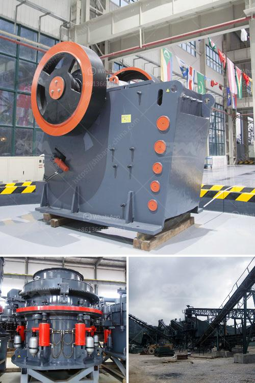

<h3>stone quarry machines for sale</h3>
Stone quarrying is the multistage process by which rock is extracted from the ground and crushed to produce aggregate, which is then used in various construction purposes. The machines used in stone quarrying are essential for the production of high-quality sand and gravel. These powerful machines make mining and quarrying tasks safer and more efficient, reducing the amount of manual labor required and minimizing the risk of accidents.

Stone quarry machines for sale offer a significant investment opportunity for businesses of all sizes. These machines are specifically designed to break down all types of stones into different sizes, making them highly versatile. They can crush rocks of various hardness levels, whether it is limestone, granite, basalt, or any other type of stone. With the ability to produce crushed stone in different sizes, these machines cater to the diverse needs of the construction industry.

One of the key advantages of stone quarry machines for sale is their ability to move easily between sites. The mobility of these machines means that they can be used in different locations, improving the efficiency of quarry operations. Additionally, modern machines are equipped with advanced technology, such as GPS tracking, which allows operators to monitor the machine's performance remotely, ensuring optimal production and reducing downtime.

Investing in stone quarry machines for sale can provide a competitive edge for businesses looking to expand their operations. With the ability to produce high-quality aggregates consistently, companies can meet the growing demand for construction materials. Moreover, these machines also contribute to environmental sustainability by recycling waste materials, such as concrete and asphalt, into usable aggregates.

In conclusion, stone quarry machines for sale have revolutionized the mining and quarrying industry. The versatility, mobility, and efficiency of these machines make them indispensable for any construction business. Investing in these machines can lead to increased productivity and profitability, as well as contribute to a more sustainable future. Whether it is for large-scale quarrying or small-scale mining, stone quarry machines offer a range of benefits that cannot be ignored.
<h3>Contact us</h3><ul><li><strong>Whatsapp:&nbsp;<a href="https://wa.me/8613661969651">+8613661969651</a></strong></li><li><a href="https://swt.shibang-china.com/?git&amp;zhl&amp;stone quarry machines for sale"><strong>Online Service(chat now)</strong></a></li></ul><h3>Related</h3><ul><li><a href='quartz stone crushing milling.md'>quartz stone crushing milling</a></li><li><a href='double roller stone cracher.md'>double roller stone cracher</a></li><li><a href='how to ball mill magnesium.md'>how to ball mill magnesium</a></li><li><a href='grinding mill for sale.md'>grinding mill for sale</a></li><li><a href='ballast crushing machine in kenya.md'>ballast crushing machine in kenya</a></li></ul>