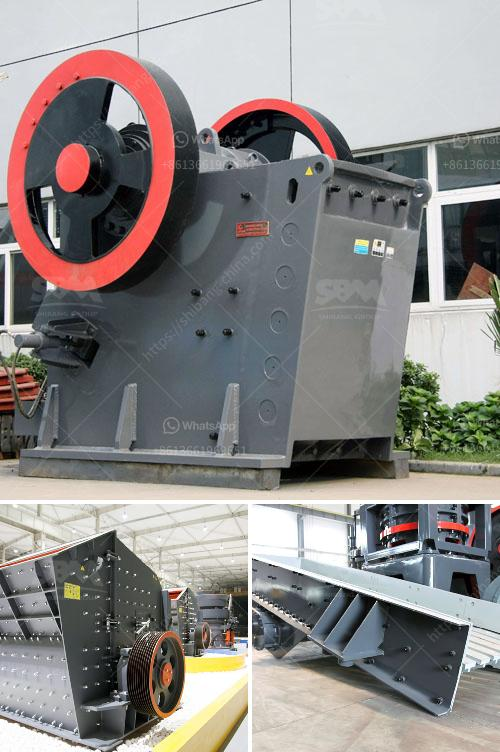

<h3>stone quarry machines</h3>
Stone quarry machines are used in mining and construction projects, offering a wide range of machinery for the extraction and processing of limestone and other types of natural stones. With high-quality materials and advanced technology, these machines ensure efficient and reliable operations, enhancing productivity and profitability.

One of the essential machines in a stone quarry is the crusher. Crushers are used to break larger rocks into smaller, more manageable sizes, enabling efficient transportation and further processing. They come in various types, such as jaw crushers, impact crushers, and cone crushers, each offering unique features and benefits. These machines are designed to handle different types of stones, ensuring excellent crushing performance and reduced downtime.

Another crucial machine in a stone quarry is the excavator. Excavators are used for digging, loading, and moving large quantities of earth and stone. With powerful engines and hydraulic systems, these machines offer optimal efficiency, allowing operators to handle heavy loads and maneuver with ease. Excavators are available in different sizes and configurations to meet the specific needs of each quarry operation.

Furthermore, cutting machines play a significant role in stone quarrying. Wire saws and diamond blades are commonly used to cut through large blocks of stone, ensuring precision and accuracy. These machines are equipped with cutting-edge technology to minimize waste and maximize the yield of usable stone.

To complement the extraction and processing machinery, stone quarry machines also include loaders, trucks, and conveyor systems. Loaders are used to transport materials within the quarry, while trucks facilitate the transportation of stones to construction sites or storage facilities. Conveyor systems are employed to streamline the movement of stones, minimizing manual labor and enhancing operational efficiency.

In conclusion, stone quarry machines are vital equipment for the extraction, processing, and transportation of natural stones. With advanced technology and high-quality materials, these machines ensure cost-effective and sustainable operations in the mining and construction industry. Investing in reliable stone quarry machines can result in increased productivity, reduced downtime, and improved profitability for businesses in this sector.
<h3>Contact us</h3><ul><li><strong>Whatsapp:&nbsp;<a href="https://wa.me/8613661969651">+8613661969651</a></strong></li><li><a href="https://swt.shibang-china.com/?git&amp;zhl&amp;stone quarry machines"><strong>Online Service(chat now)</strong></a></li></ul><h3>Related</h3><ul><li><a href='impact crusher specifications.md'>impact crusher specifications</a></li><li><a href='list mines and quarry owners of malaysia.md'>list mines and quarry owners of malaysia</a></li><li><a href='gyratory gyratory crusher manufacturer in india.md'>gyratory gyratory crusher manufacturer in india</a></li><li><a href='german technology ball grinding machine.md'>german technology ball grinding machine</a></li><li><a href='quartz plant on sale.md'>quartz plant on sale</a></li></ul>