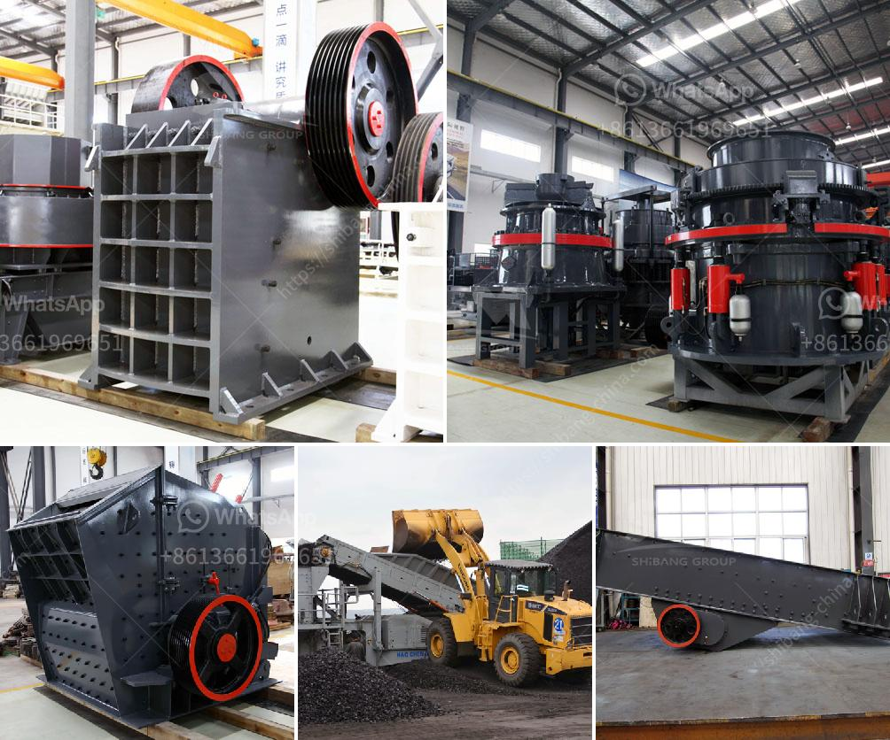

<h3>study of a fero chrome crushing plant</h3>
Ferro chrome, or Ferrochromium, is a type of ferroalloy that is an alloy between chromium and iron, generally containing 50-70% chromium by weight. Ferro chrome is produced by electric arc carbothermic reduction of chromite. Most of the world's ferro chrome is produced in South Africa, Kazakhstan, and India, which have large chromite resources.

A study was conducted on a ferro chrome crushing plant to assess its performance. This plant is capable of producing 200 tons of high-carbon ferro chrome per month. The plant consists of a crushing circuit, screening circuit, gravity separation circuit, and a jigging circuit.

In the crushing circuit, the ROM (run-of-mine) chromite ore is fed into a primary jaw crusher and reduced to a size suitable for the secondary cone crusher. The ore is then screened through a double deck vibrating screen and further reduced to the desired size in the secondary cone crusher. The crushed ore is then conveyed to the gravity separation circuit.

The gravity separation circuit consists of a spiral concentrator and shaking tables, which utilize the differences in specific gravity between chromite and gangue minerals to separate them. The concentrate from the gravity circuit is then treated in the jigging circuit, where the final cleaning and upgrading of the ferro chrome is achieved.

The study aimed to assess the overall performance of the crushing plant, including the efficiency of the individual circuits and the recovery of ferro chrome. Various parameters were monitored during the study, such as the feed rate, crusher settings, and the size distribution of the feed and products.

The results of the study indicated that the plant was operating at an average efficiency of 90%, with a recovery rate of 95%. This was considered satisfactory, as it met the plant's production targets and quality requirements. However, certain improvements were suggested to optimize the plant's performance further.

In conclusion, the study of the ferro chrome crushing plant provided valuable insights into its operation and efficiency. The plant's performance was found to be satisfactory, but improvements could be made to enhance its productivity and recovery rates. These findings will help in the continuous improvement of the plant and ensure its long-term sustainability in the ferro chrome industry.
<h3>Contact us</h3><ul><li><strong>Whatsapp:&nbsp;<a href="https://wa.me/8613661969651">+8613661969651</a></strong></li><li><a href="https://swt.shibang-china.com/?git&amp;zhl&amp;study of a fero chrome crushing plant"><strong>Online Service(chat now)</strong></a></li></ul><h3>Related</h3><ul><li><a href='gyratory gyratory crusher manufacturer in india.md'>gyratory gyratory crusher manufacturer in india</a></li><li><a href='quarry equipment in kenya.md'>quarry equipment in kenya</a></li><li><a href='how to get aluminum from bauxite.md'>how to get aluminum from bauxite</a></li><li><a href='standard conveyor belts.md'>standard conveyor belts</a></li><li><a href='gold screening plant.md'>gold screening plant</a></li></ul>