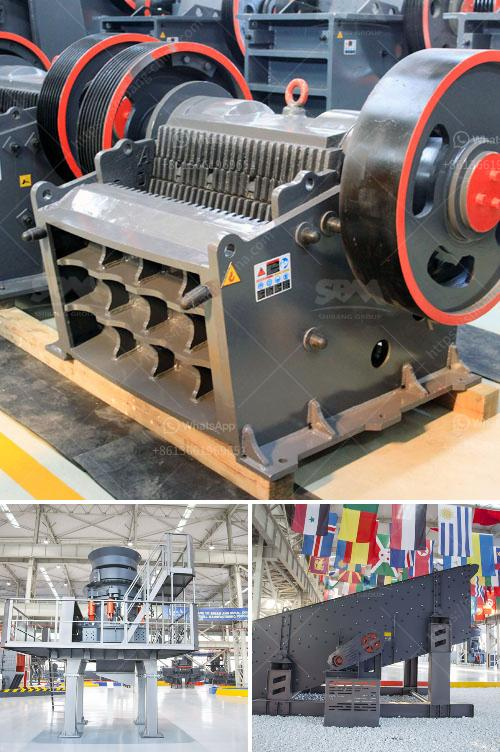

<h3>super fine powder mill</h3>
In today's fast-paced world, technology has revolutionized nearly every aspect of our lives. From smartphones to electric cars, we are constantly surrounded by inventions that make our lives easier. The same can be said for the manufacturing industry, where innovative machinery plays a crucial role in shaping various products. One such invention that has garnered significant attention and appreciation is the Super Fine Powder Mill.

The Super Fine Powder Mill is a groundbreaking piece of equipment that has transformed the powder grinding industry. Its cutting-edge technology and efficient design have revolutionized the way manufacturers obtain fine and uniform powders.

One of the key features of the Super Fine Powder Mill is its advanced grinding mechanism. Unlike traditional grinding mills that use metal blades or burrs, this mill employs high-speed rotating blades with extreme precision. This allows for a more efficient and consistent grinding process, ensuring that the final product is of the highest quality.

Moreover, the Super Fine Powder Mill boasts an adjustable grinding size feature, giving manufacturers greater control over the particle size of the final product. This is particularly important in industries such as pharmaceuticals, food processing, and cosmetics, where precise particle size is crucial for the desired end result.

Another significant advantage of the Super Fine Powder Mill is its ability to grind almost any material into a fine powder. Whether it is minerals, ores, chemicals, or even hard-to-grind substances, this machine can handle it all with ease. This versatility is a huge plus for manufacturers in various industries, as it eliminates the need for multiple grinding machines, saving time, money, and resources.

Furthermore, the Super Fine Powder Mill operates with minimal noise and vibration, making it an ideal choice for manufacturing facilities. Its low energy consumption also contributes to cost savings and reduces the ecological footprint of production processes. As sustainability becomes increasingly essential, the Super Fine Powder Mill stands out as an environmentally friendly choice.

Additionally, the Super Fine Powder Mill requires minimal maintenance, making it a reliable investment for manufacturers. With a robust build and durable materials, this machine is built to withstand heavy usage and the wear and tear associated with grinding processes. This translates to fewer interruptions in production and increased efficiency.

In conclusion, the Super Fine Powder Mill has revolutionized the powder grinding industry with its cutting-edge technology and innovative design. Its ability to deliver fine and uniform powders, versatile grinding capabilities, low noise and vibration operation, and minimal maintenance requirements make it a game-changer in the manufacturing world. As industries continue to evolve and demand higher standards, the Super Fine Powder Mill sets a new benchmark for precision and efficiency.
<h3>Contact us</h3><ul><li><strong>Whatsapp:&nbsp;<a href="https://wa.me/8613661969651">+8613661969651</a></strong></li><li><a href="https://swt.shibang-china.com/?git&amp;zhl&amp;super fine powder mill"><strong>Online Service(chat now)</strong></a></li></ul><h3>Related</h3><ul><li><a href='cost 100tph stone crusher in india.md'>cost 100tph stone crusher in india</a></li><li><a href='granite stone quarrying equipment.md'>granite stone quarrying equipment</a></li><li><a href='picture of a sand washing plant in uae.md'>picture of a sand washing plant in uae</a></li><li><a href='quarry crusher cost.md'>quarry crusher cost</a></li><li><a href='gold ore processing plant in germany.md'>gold ore processing plant in germany</a></li></ul>