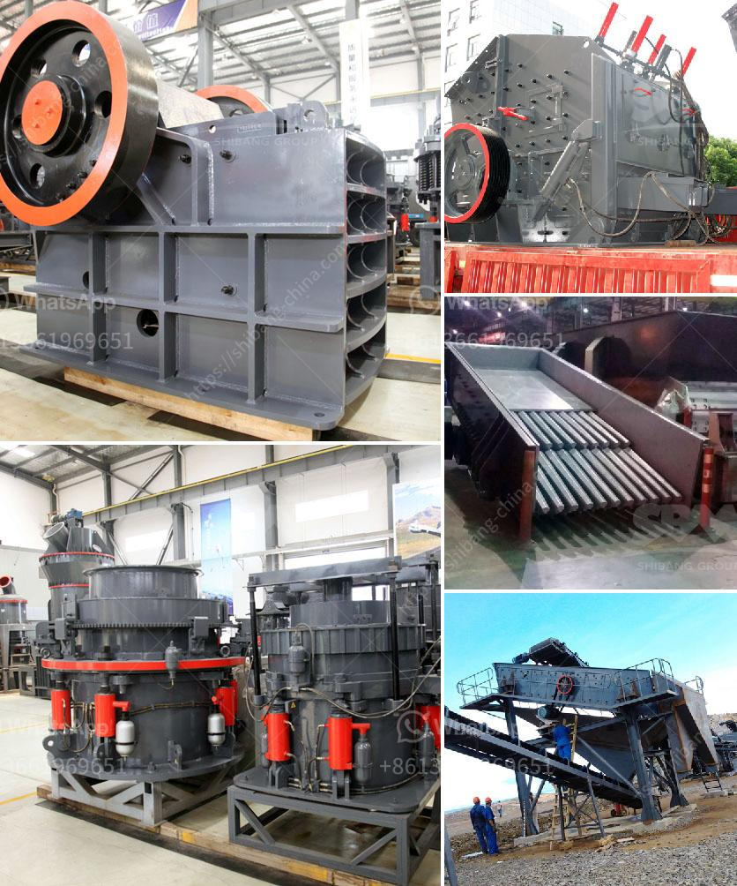

<h3>super orion ball mill for mael powder</h3>
The Super Orion ball mill has been the mill of choice for years for manufacturing high-quality mineral powders. These mills are rugged, reliable, and highly efficient, making them indispensable in the mineral powder industry. Designed for continuous operation, they can be used in combination with a wide range of product feeders and process technologies to produce the desired end product.

One key advantage of the Super Orion ball mill is its versatility. It allows operators to change the product fineness quickly and easily, ensuring consistent and precise particle size distribution. This flexibility makes the Super Orion ball mill a popular choice for producing a wide range of mineral powders, including calcium carbonate, talc, and graphite.

The Super Orion ball mill ensures low-wear and cost-effective processing. It features a unique and innovative drive system that provides high grinding performance and extraordinary energy efficiency. The truly efficient transmission of energy ensures the lowest possible grinding temperatures, resulting in reduced wear on mill components and extended operational life.

Another notable feature of the Super Orion ball mill is the integration of an air classifier. This component enables the mill to handle not only grinding tasks but also classification, ensuring that the finished product meets the required specifications. The air classifier is designed to separate and recover the coarse particles while allowing the fine particles to exit the mill.

In summary, the Super Orion ball mill is a highly efficient tool for the processing of mael powder. It combines outstanding performance with high reliability and ease of operation. The flexibility of the machine allows it to meet a wide range of mineral powder production needs while ensuring low-wear and cost-effective processing. With its integrated air classifier, the Super Orion ball mill can consistently produce high-quality powders with the desired particle size distribution.
<h3>Contact us</h3><ul><li><strong>Whatsapp:&nbsp;<a href="https://wa.me/8613661969651">+8613661969651</a></strong></li><li><a href="https://swt.shibang-china.com/?git&amp;zhl&amp;super orion ball mill for mael powder"><strong>Online Service(chat now)</strong></a></li></ul><h3>Related</h3><ul><li><a href='mobile stone crusher 100 tph bangalore.md'>mobile stone crusher 100 tph bangalore</a></li><li><a href='stone crusher used machinery for sale in india.md'>stone crusher used machinery for sale in india</a></li><li><a href='used basalt stone crusher price in uae.md'>used basalt stone crusher price in uae</a></li><li><a href='ball mills at best price in india.md'>ball mills at best price in india</a></li><li><a href='zircon sand mining companies list in canada.md'>zircon sand mining companies list in canada</a></li></ul>