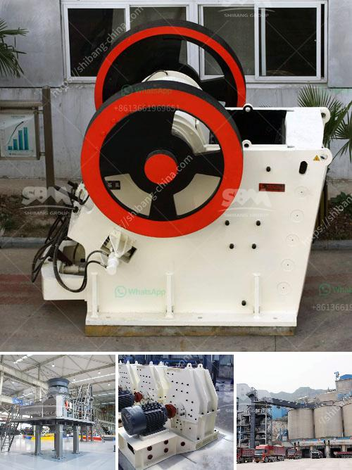

<h3>supplier of vibrating screen in philippines</h3>
Are you in the mining or construction industry and in need of a reliable supplier for vibrating screens in the Philippines? Look no further, as we introduce you to ABC Vibrating Screens, one of the leading suppliers of these specialized screens in the country. 

Vibrating screens are essential equipment in various industries, especially in the mining and construction sector. These screens are used to separate particles according to their sizes through a vibrating motion, making them a vital tool in the screening process. 

At ABC Vibrating Screens, we take pride in offering high-quality vibrating screens that can effectively classify a wide range of materials. Our screens are durable, reliable, and capable of handling various materials, including aggregates, ores, coal, and many others. 

One of the key advantages of our vibrating screens is their flexibility in customization. We understand that each customer has unique requirements, so we offer screens in different sizes, deck configurations, and mesh options to accommodate diverse needs. Whether you need a single-deck or multi-deck screen, we have the right solution for you. 

Another aspect that sets us apart is our commitment to customer satisfaction. We prioritize providing excellent customer service from start to finish. Our experienced team is readily available to provide technical support, answer inquiries, and ensure a seamless purchasing experience. We understand that time is valuable in your industry, so we strive to offer prompt delivery and efficient after-sales support. 

ABC Vibrating Screens is built on a foundation of integrity and trust. We only source our screens from trusted manufacturers, ensuring that every product we offer meets the highest standards of quality and performance. With our reliable screens, you can enhance your operations, reduce downtime, and improve overall productivity. 

Investing in a vibrating screen from ABC Vibrating Screens means investing in a long-term solution that will deliver consistent performance for your operations. Whether you are in need of a single unit or require bulk orders, we are ready to cater to your needs. 

For all your vibrating screen requirements in the Philippines, choose ABC Vibrating Screens. Contact us today to discuss your needs, and let us provide you with a reliable solution that will exceed your expectations.
<h3>Contact us</h3><ul><li><strong>Whatsapp:&nbsp;<a href="https://wa.me/8613661969651">+8613661969651</a></strong></li><li><a href="https://swt.shibang-china.com/?git&amp;zhl&amp;supplier of vibrating screen in philippines"><strong>Online Service(chat now)</strong></a></li></ul><h3>Related</h3><ul><li><a href='cement export price in ethiopia.md'>cement export price in ethiopia</a></li><li><a href='cobble stone machine nigeria.md'>cobble stone machine nigeria</a></li><li><a href='marble powder mill machinery.md'>marble powder mill machinery</a></li><li><a href='talc powder making.md'>talc powder making</a></li><li><a href='jaw crusher for sale south africa.md'>jaw crusher for sale south africa</a></li></ul>