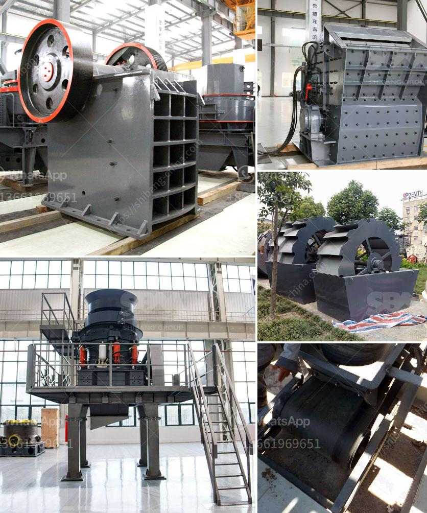

<h3>suppliers of conveyor belts in south africa</h3>
Conveyor belts are used in a wide variety of industries for transporting goods and materials from one place to another.  They are essential in many production processes, enabling efficient and smooth movement of items across different stages of manufacturing. In South Africa, many industries rely on the use of conveyor belts, from mining and manufacturing to agriculture and food processing. Therefore, reliable suppliers of conveyor belts are crucial to ensure the smooth running of these industries.

One of the leading suppliers of conveyor belts in South Africa is Truco. Truco offers a range of conveyor belt solutions for various applications, including textile reinforced, steel cord, chevron, heat resistant, and oil-resistant belts. With over 100 years of experience in the industry, Truco has established itself as a trusted supplier, providing durable and high-quality conveyor belts to meet the specific needs of its customers. They also offer on-site splicing, pulley lagging, and belt repair services to ensure the longevity and optimal performance of their conveyor belts.

Another reputable supplier of conveyor belts in South Africa is Flexco. Flexco provides innovative solutions to maximize belt conveyor productivity and efficiency. Their product range includes belt cleaners, belt fasteners, belt trainers, impact beds, and other accessories essential for the proper functioning of conveyor belts. With a strong emphasis on research and development, Flexco continuously designs and manufactures products that enhance the safety, reliability, and performance of conveyor belt systems.

Another notable supplier of conveyor belts in South Africa is Continental ContiTech. ContiTech offers a comprehensive range of conveyor belts suitable for various industries, including mining, manufacturing, and construction. Their product portfolio includes textile and steel cord belts, as well as specialty belts for specific applications such as flame retardant, oil-resistant, and acid-resistant belts. With a presence in over 150 countries worldwide, Continental ContiTech is a globally recognized supplier of conveyor belts known for its high standards of quality and reliability.

Moreover, Dunlop Belting Products is another prominent supplier of conveyor belts in South Africa. With over 100 years of industry experience, Dunlop offers a wide range of conveyor belts suited for different applications, including mining, industrial, and agricultural sectors. Their products are known for their durability, long lifespan, and excellent performance even in the most challenging environments. Dunlop also provides comprehensive after-sales services, including technical support, maintenance, and training, ensuring the optimal performance and longevity of their conveyor belts.

In conclusion, the suppliers of conveyor belts in South Africa play a vital role in supporting various industries by providing high-quality, durable, and reliable conveyor belt solutions. Truco, Flexco, Continental ContiTech, and Dunlop Belting Products are some of the reputable suppliers in South Africa known for their technologically advanced and innovative conveyor belt solutions. These suppliers not only offer a wide range of conveyor belts but also provide additional services such as installation, maintenance, and repair, contributing to the efficiency, safety, and overall productivity of their customer's conveyor belt systems.
<h3>Contact us</h3><ul><li><strong>Whatsapp:&nbsp;<a href="https://wa.me/8613661969651">+8613661969651</a></strong></li><li><a href="https://swt.shibang-china.com/?git&amp;zhl&amp;suppliers of conveyor belts in south africa"><strong>Online Service(chat now)</strong></a></li></ul><h3>Related</h3><ul><li><a href='small scale gold mining in kadoma zimbabwe.md'>small scale gold mining in kadoma zimbabwe</a></li><li><a href='jaw crusher machine supplier.md'>jaw crusher machine supplier</a></li><li><a href='limestone powder machine in india.md'>limestone powder machine in india</a></li><li><a href='price pe 600 900 stone crusher.md'>price pe 600 900 stone crusher</a></li><li><a href='stone crusher for sale.md'>stone crusher for sale</a></li></ul>