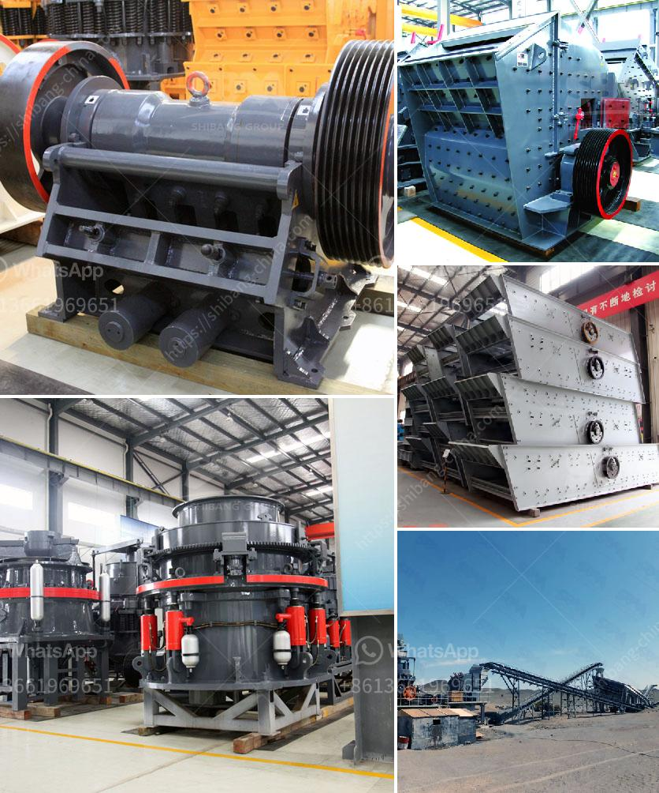

<h3>suppliers of jaw crushers in south africa</h3>
Jaw crushers are commonly used in the mining, construction, and aggregate industries. These machines are used primarily for crushing stone and rock, as well as minerals and ores. Suppliers of jaw crushers in South Africa have been in the business for many years and have built strong relationships with local clients who have come to trust these high-quality machines and the supplier’s commitment to customer service.

One of the leading suppliers of jaw crushers in South Africa is Pilot Crushtec. Pilot Crushtec is based in Johannesburg and supplies jaw crushers across the country. Pilot Crushtec operates from a modern facility that is well equipped with the latest technology, ensuring that their machines are of the highest quality.

Pilot Crushtec offers a comprehensive range of jaw crushers to suit all applications and budgets. Their extensive range includes the popular QJ341, QJ241, and QJ331 models which have proven to be reliable and efficient machines in a variety of applications. These jaw crushers are equipped with powerful engines that ensure high productivity and are built to withstand tough conditions. With their excellent track record, clients can rely on Pilot Crushtec to provide them with jaw crushers that will stand the test of time.

Another reputable supplier of jaw crushers in South Africa is E byEvoquip. E byEvoquip is a subsidiary of the well-established global materials processing company Terex. E byEvoquip prides itself on providing customers with jaw crushers that are highly efficient, reliable, and easy to use. The company offers a range of jaw crushers, including the Bison 35, Bison 120, and Bison 160 models, all of which are compact and easy to transport. These jaw crushers are designed to be used in a wide range of applications, from small construction projects to large-scale quarries.

Suppliers of jaw crushers in South Africa understand the need for quality machines that can respond to the toughest demands. They are committed to delivering jaw crushers that offer excellent performance, reliability, and durability, at a competitive price. With a wide range to choose from, suppliers are able to provide customers with jaw crushers that meet their specific needs.

In addition to Pilot Crushtec and E byEvoquip, there are other suppliers of jaw crushers in South Africa. These suppliers are known for their commitment to customer service and delivering high-quality machines. With their extensive experience and expertise, they can help customers select the right jaw crusher for their unique needs.

Overall, suppliers of jaw crushers in South Africa understand the importance of investing in high-quality machines that deliver efficient and reliable performance. With an extensive range to choose from and competitive prices, clients can rely on these suppliers to provide them with jaw crushers that meet their specific requirements. Whether it is for a mining operation, construction project, or quarry, suppliers of jaw crushers in South Africa offer a comprehensive range of machines that are built to handle the tough demands of their respective industries.
<h3>Contact us</h3><ul><li><strong>Whatsapp:&nbsp;<a href="https://wa.me/8613661969651">+8613661969651</a></strong></li><li><a href="https://swt.shibang-china.com/?git&amp;zhl&amp;suppliers of jaw crushers in south africa"><strong>Online Service(chat now)</strong></a></li></ul><h3>Related</h3><ul><li><a href='grinding mills suppliers in china.md'>grinding mills suppliers in china</a></li><li><a href='crusher machine supplier malaysia.md'>crusher machine supplier malaysia</a></li><li><a href='calcium carbonate machine supplier in turkey.md'>calcium carbonate machine supplier in turkey</a></li><li><a href='coal crushing and washing plant for sale south africa.md'>coal crushing and washing plant for sale south africa</a></li><li><a href='mobile crushing machine sales in south africa.md'>mobile crushing machine sales in south africa</a></li></ul>