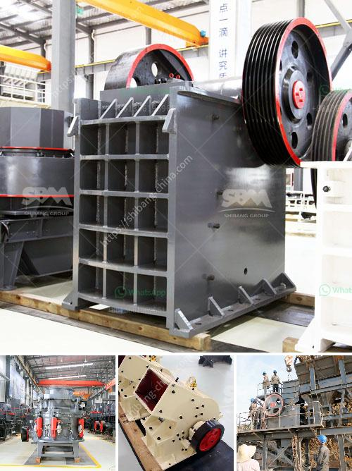

<h3>talc powder making</h3>
Talc powder is a common household item that is used in a variety of ways. From personal care products to industrial applications, talc powder is a versatile substance that serves various purposes. In this article, we will delve into the process of talc powder making, discussing its production, uses, and potential risks associated with its use.

Talc, also known as talcum powder, is a soft, naturally occurring mineral composed primarily of magnesium, silicon, and oxygen. The mineral is mined from deposits located deep underground and then processed to create the fine, white powder we are familiar with.

The process of talc powder making begins with the extraction of raw ores from underground mines. These ores are then crushed and ground into a powder-like consistency. The resulting material is then purified through a series of steps to remove any impurities or contaminants.

After the purification process, the talc powder is ready for various applications. One of the most common uses of talc powder is in cosmetic and personal care products such as baby powder, body powders, and makeup. Talc powder is appreciated for its ability to absorb moisture, reduce friction, and create a smoother texture. Its use in these products provides a soothing effect and helps to keep the skin dry and comfortable.

Apart from personal care products, talc powder is also used in the manufacturing of ceramics, paints, rubber, and plastics. It serves as a filler material, enhancing the strength and durability of these products. Talc powder can also be incorporated into paper and pulp production to improve the smoothness and brightness of the final product.

While talc powder has various applications, there have been concerns regarding its safety. Inhalation or prolonged exposure to talc powder has been associated with adverse health effects, particularly in occupational settings. Some studies suggest a potential link between talc powder and respiratory issues, such as chronic lung disease and lung cancer. However, these studies are inconclusive, and more research is needed to establish a definitive link between talc powder and these health issues.

To address these concerns, regulatory agencies have imposed safety standards and regulations on the production and use of talc powder. These standards aim to limit exposure levels and ensure the purity of talc-based products.

In conclusion, talc powder is a widely used substance with several applications in various industries. Its production involves extracting raw ores, crushing and grinding them into a fine powder, and purifying it to remove impurities. Talc powder finds uses in personal care products, ceramics, paints, and many other manufacturing processes. While concerns about the safety of talc powder exist, regulatory bodies impose safety standards to minimize potential risks.
<h3>Contact us</h3><ul><li><strong>Whatsapp:&nbsp;<a href="https://wa.me/8613661969651">+8613661969651</a></strong></li><li><a href="https://swt.shibang-china.com/?git&amp;zhl&amp;talc powder making"><strong>Online Service(chat now)</strong></a></li></ul><h3>Related</h3><ul><li><a href='price jaw crusher 100tph india.md'>price jaw crusher 100tph india</a></li><li><a href='super orion ball mill for mael powder.md'>super orion ball mill for mael powder</a></li><li><a href='screening machine for phosphate mineral processing zmy.md'>screening machine for phosphate mineral processing zmy</a></li><li><a href='equipment jaw crusher for sale philippine.md'>equipment jaw crusher for sale philippine</a></li><li><a href='malaysia gravel crusher machine.md'>malaysia gravel crusher machine</a></li></ul>