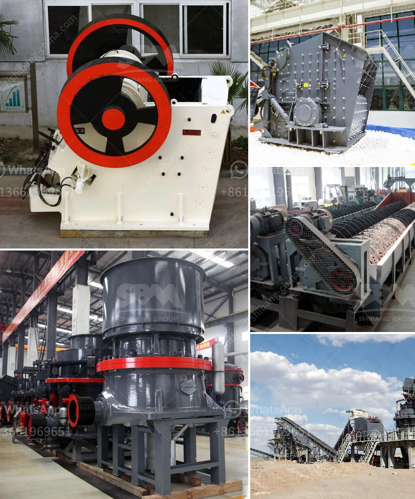

<h3>talc powder plant</h3>
Talc powder, also known as talcum powder, is derived from a naturally occurring mineral called talc. This mineral is composed primarily of magnesium, silicon, and oxygen, making it an invaluable resource with numerous industrial applications. The talc powder plant plays a pivotal role in extracting and processing this mineral, transforming it into a versatile product that has revolutionized many industries.

One of the primary applications of talc powder is in the cosmetics industry. Due to its softness and ability to absorb moisture, talc powder is commonly used in various cosmetic products such as baby powders, body powders, deodorants, and makeup. It provides a smooth and silky texture, helping to absorb excess oil and moisture on the skin, making it an excellent ingredient for products that promote dryness and prevent skin irritations.

Furthermore, talc powder finds extensive usage in the manufacturing of ceramics. The addition of talc enhances the performance of ceramic materials due to its unique properties. Talc acts as a fluxing agent, reducing firing temperatures and improving the firing process. It also improves the mechanical strength of ceramic products, making them more resistant to thermal shocks. Moreover, talc powder serves as a glazing agent, enhancing the overall appearance and finish of ceramic goods.

Additionally, talc powder has found its way into the pharmaceutical industry, where it is used in various medicinal products. Its natural lubricating properties make it an ideal ingredient in tablets and other oral medications, ensuring smooth and effective dosage administration. Moreover, talc powder is used in topical treatments and ointments, providing a soothing effect and preventing skin irritations.

The process of extracting and processing talc powder involves several stages in a talc powder plant. The initial step involves mining the talc-containing ore from deposits deep within the earth. Once the ore is extracted, it is transported to the plant for further processing. The ore is then crushed into smaller pieces and subjected to grinding and milling processes to reduce it to a fine powder. Various purification methods are implemented to remove impurities and improve the quality of the final product. The processed talc powder is then packaged and dispatched to industries around the world.

However, it is crucial to ensure the highest safety standards in talc powder production. Recent concerns have been raised regarding potential health risks associated with talcum powder due to traces of asbestos contamination. Therefore, strict quality control measures are essential to prevent any such contamination and maintain the purity of the product. Talc powder plants must adhere to rigorous testing protocols and regulations to safeguard consumer health and confidence.

In conclusion, the talc powder plant is an integral part of the manufacturing process that unleashes the potential of talc, a naturally occurring mineral. From cosmetic products to ceramics and medicines, talc powder offers a wide range of applications due to its inherent properties. However, it is crucial for talc powder manufacturers to prioritize safety and quality control measures to ensure the purity and integrity of their products. With proper precautions in place, the talc powder industry continues to thrive, contributing to numerous sectors and enhancing numerous consumer products.
<h3>Contact us</h3><ul><li><strong>Whatsapp:&nbsp;<a href="https://wa.me/8613661969651">+8613661969651</a></strong></li><li><a href="https://swt.shibang-china.com/?git&amp;zhl&amp;talc powder plant"><strong>Online Service(chat now)</strong></a></li></ul><h3>Related</h3><ul><li><a href='cone crusher manufacturers in usa.md'>cone crusher manufacturers in usa</a></li><li><a href='stone crusher machine dubai.md'>stone crusher machine dubai</a></li><li><a href='quartz stone dust equipment.md'>quartz stone dust equipment</a></li><li><a href='sample of joint operations agreement quarry mining.md'>sample of joint operations agreement quarry mining</a></li><li><a href='types of ball mill machine for gold.md'>types of ball mill machine for gold</a></li></ul>