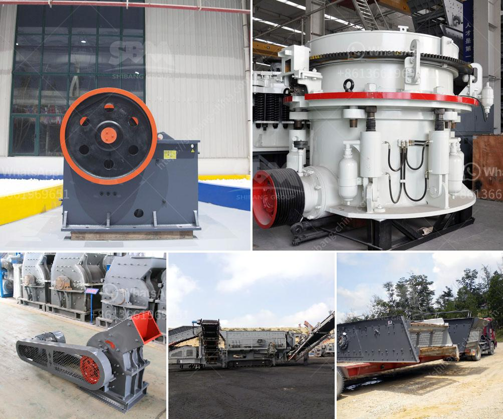

<h3>talcum powder grinding machine in kerala</h3>
Talcum powder, also known as baby powder, has been widely used for many years by both adults and children as a hygiene product. Its ability to absorb moisture and reduce friction has made it a popular choice for a variety of purposes, including keeping the skin dry and preventing rashes. In Kerala, a southern state of India, the use of talcum powder is particularly prevalent due to the hot and humid climate.

With the increasing demand for talcum powder in Kerala, the need for efficient grinding machines to produce this product has become essential. A talcum powder grinding machine is designed to produce talcum powder in the desired particle size distribution with high efficiency. Talcum powder can be produced in different fineness ranges, depending on the application requirements.

The talcum powder grinding machine provides fine grinding of soft materials, such as talc, gypsum, barite, limestone, etc., for a wide range of industries, including the cosmetics, pharmaceutical, food, and chemical industries. Its high efficiency and energy-saving capabilities are the result of the optimization of the grinding chamber structure and the rotation speed of the classifier rotor.

Grinding machines for talcum powder are designed with advanced technology, which saves energy and reduces energy consumption. With the development of the economy, the demand for talcum powder has increased significantly, and the market demand for talcum powder grinding machines has also increased. Therefore, manufacturers have invested heavily in the production of talcum powder grinding machines to meet the growing market demand.

In conclusion, the talcum powder grinding machine in Kerala plays an essential role in the production of talcum powder. It not only helps to improve productivity and efficiency but also ensures the quality and consistency of the final product. As the demand for talcum powder continues to rise in Kerala, manufacturers are continuously innovating and improving their grinding machines to meet the market's needs.
<h3>Contact us</h3><ul><li><strong>Whatsapp:&nbsp;<a href="https://wa.me/8613661969651">+8613661969651</a></strong></li><li><a href="https://swt.shibang-china.com/?git&amp;zhl&amp;talcum powder grinding machine in kerala"><strong>Online Service(chat now)</strong></a></li></ul><h3>Related</h3><ul><li><a href='calcium carbonate powder processing plant.md'>calcium carbonate powder processing plant</a></li><li><a href='manufacturing company for ball mill.md'>manufacturing company for ball mill</a></li><li><a href='rock crushing kenya.md'>rock crushing kenya</a></li><li><a href='ore crusher copper ore crusher.md'>ore crusher copper ore crusher</a></li><li><a href='block making machine in canada.md'>block making machine in canada</a></li></ul>