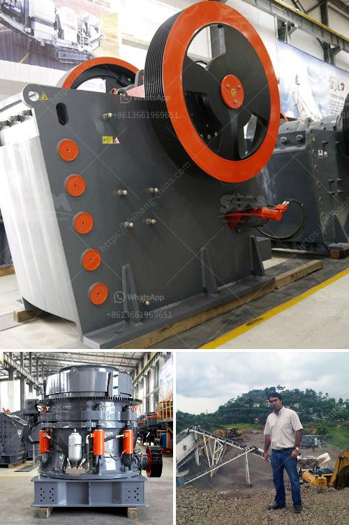

<h3>talcum powder supplier for production</h3>
Talcum powder, a soft and silky mineral that is widely used in various industries, has become an integral part of many production processes. From cosmetics to pharmaceuticals, the demand for talcum powder has been steadily increasing. To meet this growing demand, manufacturers rely on trusted talcum powder suppliers who can provide them with the highest quality product.

One of the key factors contributing to talcum powder's popularity is its ability to absorb moisture and reduce friction. In the cosmetic industry, talcum powder is commonly used in products such as baby powder, body powders, and makeup, due to its excellent absorbent properties and silky texture. It is also used in the production of pharmaceuticals, where it is an essential ingredient in medications and as a lubricant for tablets.

To ensure the reliability and consistency of their production processes, manufacturers need to partner with reputable talcum powder suppliers. These suppliers play a crucial role in providing them with a high-quality product that meets stringent industry standards and regulations.

When selecting a talcum powder supplier, there are several factors that manufacturers should consider. First and foremost, quality control should be a top priority. Reliable suppliers have strict quality control measures in place to ensure that their talcum powder meets the required specifications. This includes thorough testing for impurities and contaminants, as well as ensuring the product is correctly formulated.

Moreover, a reputable talcum powder supplier should have a reliable and efficient supply chain to meet the manufacturers' production needs. This means delivering the product on time and in the required quantities. Punctuality and consistency are vital in today's fast-paced industry, where delays can have significant consequences on production timelines.

In addition to the product quality and efficient supply chain, manufacturers should also consider the talcum powder supplier's commitment to sustainability. With growing environmental concerns, it is essential for manufacturers to partner with suppliers who prioritize sustainable practices. This can include responsible sourcing of raw materials, reducing energy use during production, and implementing environmentally friendly packaging options.

Furthermore, a talcum powder supplier that understands the industry trends and actively participates in research and development can be highly advantageous for manufacturers. By staying updated on the latest advancements in talcum powder production, suppliers can offer innovative solutions that can enhance manufacturers' product offerings and help them stay competitive in the market.

In conclusion, the demand for talcum powder in various industries continues to grow, making it essential for manufacturers to partner with reliable and reputable suppliers. From cosmetics to pharmaceuticals, talcum powder plays a vital role in many production processes, and its quality and consistency are of utmost importance. By considering factors such as product quality, supply chain efficiency, sustainability, and research and development capabilities when selecting a supplier, manufacturers can ensure the success of their production processes and meet the evolving demands of the market.
<h3>Contact us</h3><ul><li><strong>Whatsapp:&nbsp;<a href="https://wa.me/8613661969651">+8613661969651</a></strong></li><li><a href="https://swt.shibang-china.com/?git&amp;zhl&amp;talcum powder supplier for production"><strong>Online Service(chat now)</strong></a></li></ul><h3>Related</h3><ul><li><a href='metal pulverizer crusher suppliers.md'>metal pulverizer crusher suppliers</a></li><li><a href='stone crusher machine in the philippines for rent.md'>stone crusher machine in the philippines for rent</a></li><li><a href='picture of a rock crusher machine.md'>picture of a rock crusher machine</a></li><li><a href='denver ball mills.md'>denver ball mills</a></li><li><a href='limestone rock crushing.md'>limestone rock crushing</a></li></ul>